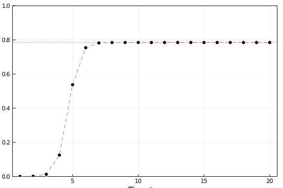
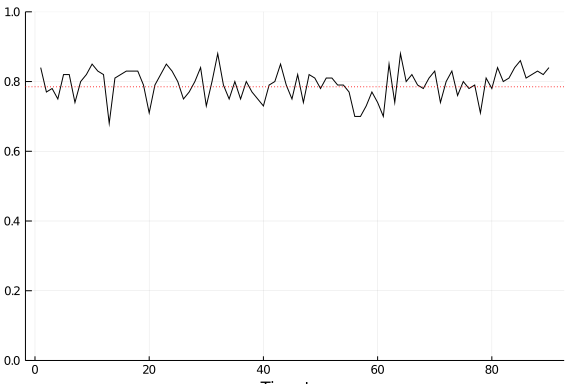

# Introduction

> Do not edit this file - it is meant to serve as a template for the most
> important parts of the homework system.

A large number of organisms, typically those who reproduce asexually, have
haploid genomes, in which a single copy of every gene is present. In the absence
of recombination, it is interesting to question how diversity can be maintained.
We will set up as simple model of change of allelic frequencies in a highly
simplified context, in which organisms have a single gene, with a more
competitive allelle $A$, and a less competitive variant $a$.

## Required packages

````julia
using Plots
using Distributions
````


## Model description and justification

As the individuals in our model carry either $A$ or $a$, we can simply model the
frequency of $A$ at time $t$, called $p(t)$, and write that the frequency of $a$
is $1-p(t)$.

We further assume that the allele $A$ has a fitness of $\omega_A$, and the
allele $a$ has a fitness of $\omega_a$. Because we want to represent the fact
that $a$ is less fit than $A$, we will set $\omega_A = 1$, and $\omega_a =
(1-s)$, where $s$ is a number in $[0,1]$ representing the strength of the
selection against $a$.

The proportion of allele $A$ in the population at the next timestep is called
$p(t+1)$ -- it can be calculated based on the fitness of $A$ *relative* to the
total fitness of the population. The total fitness of the population is

$$\omega_A p(t) + \omega_a (1-p(t))$$

Therefore, the frequency of $A$ at time $t+1$ is

$$p(t+1) = \frac{\omega_A p(t)}{\omega_A p(t) + \omega_a (1-p(t))}$$

Because replication is always imperfect, we add to this model a mutation rate
$\mu$, which varies in $[0,1[$. Adding the mutations is simply a matter of
decreasing the proportion of $A$ at the next timestep (by a factor of $\mu$),
and so the final equation for the frequency of $A$ through time is

$$p(t+1) = (1-\mu)\frac{\omega_A p(t)}{\omega_A p(t) + \omega_a (1-p(t))}$$

We can note that there is no possibility for an allele $a$ to return to an
allele $A$ through mutation. This is a reasonable assumption, if one assumes
that $a$ is a simplification for "all the alleles that are not the most
competitive one", and further assumes that the chance of mutating from $A$ to
$a$ and then having only the reversal mutation is minuscule. This represents an
acceptable simplification, which also greatly simplifies the analysis of the
model.

All of the parameters and in this model are either frequencies ($\mu$, $p$), or
dimensionless ($s$) -- therefore, the model is dimensionless. This being said,
we know that all variables and parameters must be within $[0,1]$.

## Model analysis

This model is a discrete time model, so it has an equilibrium every time $p(t+1)
= p(t)$. We will look a number of special cases, and then give the general
solution. For every $p$ that is an equilibrium, we will note it $\hat p$.

### Special case 1 - no mutation

In the absence of mutation, the equilibrium exists if

$$\hat p = \frac{\omega_A \hat p}{\omega_A \hat p + \omega_a (1-\hat p)}$$

We can express this as

$$\hat p (\omega_A \hat p + \omega_a (1-\hat p)) = \omega_A \hat p$$

which simplifies to

$$\omega_A = \omega_A \hat p + \omega_a (1-\hat p)$$

This further simplifies to

$$\omega_A - \omega_a = \hat p(\omega_A - \omega_a)$$

This can be written as

$$\hat p = \frac{\omega_A - \omega_a}{\omega_A - \omega_a} = 1$$

There is no possible polymorphism in the absence of mutation.

### Special case 2 - A is initially absent

In the absence of $A$ initially, we know that $p(t) = 0$; therefore, $p(t+1)$ is
also 0, and the allele $A$ cannot invade. This can be verified by noting the
total fitness as $\omega$, and observing that $p(t+1)$ becomes $0/\omega$.

### General case

In the general case, we need to solve for

$$\hat p = (1-\mu)\frac{\omega_A \hat p}{\omega_A \hat p + \omega_a (1-\hat p)}$$

We can isolate the term in $\mu$ this way:

$$(1-\mu) = \hat p \frac{\omega_A \hat p + \omega_a (1-\hat p)}{\omega_A \hat p}$$

After cancelling $\hat p$ in the right hand side, we have

$$(1-\mu) = \frac{\omega_A}{\omega_A}\hat p + \frac{\omega_a}{\omega_A}(1-\hat p)$$

This simplifies to

$$(1-\mu) = \hat p + \frac{\omega_a}{\omega_A}(1-\hat p)$$

As we have defined $\omega_A = 1, \omega_a = 1-s$, we can re-write the previous
expression as

$$(1-\mu) = \hat p + (1-s)(1-\hat p)$$

This further recudes to

$$(1-\mu) = 1 - s + s\hat p$$

which is finally

$$\hat p = \frac{s-\mu}{s} = 1-\frac{\mu}{s}$$

This equilibrium exists, *i.e.* $\hat p > 0$ *iff* $\mu/s < 1$, which is to say
whenever the mutation rate is lower than the strength of selection against $a$.

## Simulations

### Theoretical predictions

We can write a simple model that takes $p(t)$ as an argument, and $\mu$ and $s$
as optional arguments, and returns $p(t+1)$:

````julia
"""
DOC GOES HERE
"""
function haploid(p::Float64=0.5; μ::Float64=0.01, s::Float64=0.1)
  # All of the parameters and variables must be between 0 and 1
  @assert 0.0 ≤ μ ≤ 1.0
  @assert 0.0 ≤ s ≤ 1.0
  @assert 0.0 ≤ p ≤ 1.0
  ω = p+(1-s)*(1-p)
  return (1-μ)*(p/ω)
end
````


````
Main.##WeaveSandBox#402.haploid
````


We can use this function to generate a time series, and ensure that the model
reaches the predicted equilibrium:

````julia
ts = zeros(Float64, 20)
ts[1] = 0.0001
for i in 2:length(ts)
  ts[i] = haploid(ts[i-1]; μ=0.2, s=0.93)
end
p_pred = 1-0.2/0.93
plot(ts,
  frame=:box, leg=false,
  m = :circle, ms=5,
  msw=2, msc=:white,
  c=:grey, mc=:black, ls=:dash,
  xlabel = "Timestep",
  ylabel = "Frequency of A", ylim=(0,1)
)
hline!([p_pred], c=:red, ls=:dot)
````





We can also write a function to give the value of $\hat p$ directly:

````julia
"""
DOC GOES HERE
"""
function equilibrium(;μ::Float64=0.01, s::Float64=0.3)
  # All of the parameters and variables must be between 0 and 1
  @assert 0.0 ≤ μ ≤ 1.0
  @assert 0.0 ≤ s ≤ 1.0
  return μ>s ? 0 : 1-(μ/s)
end
````


````
Main.##WeaveSandBox#402.equilibrium
````


We will use this function to show how the predicted equilibrium changes when the
rate of mutation increases:

````julia
M = 10.0.^(-3:0.1:-0.5)
eq = [equilibrium(μ=m, s=0.2) for m in M]
plot(M, eq,
  c=:black, fill=(:grey, 0, 0.2),
  leg=false,
  frame=:box,
  xaxis=:log, xlabel="Mutation rate", xlim=(0.001,1.0),
  ylabel="Equilibrium frequency of A", ylim=(0,1))
vline!([0.2], c=:red, ls=:dot)
````


### Stochastic simulations

This model represents processes that are stochastic. Therefore, we will
implement a stochastic simulation scenario, based on the assumption that the
population is of finite size.

````julia
n = 100 # population size
A = rand(1:n)
````


````
84
````


We know that $p(t+1)$ is a proportion in the next time step, so we can interpet
it as the probability of a future individual having the allele $A$. As there are
$n$ individuals in the population, we can get the number of alleles $A$ as being
the result of a random draw in a Binomial distribution with $n$ draws, and a
$p(t+1)$ success rate.

````julia
ts = zeros(Int64, 90)
ts[1] = A
for i in 2:length(ts)
  ts[i] = rand(Binomial(n, haploid(ts[i-1]/n; μ=0.2, s=0.93)))
end
plot(ts./n, c=:black, ylim=(0,1), leg=false,
  xlabel="Timestep", ylabel="Frequency of A")
hline!([equilibrium(μ=0.2, s=0.93)], c=:red, ls=:dot)
````





This simple simulation reveals that the presence of stochasticity can trigger
variations around the equilibrium. This effect may be accentuated in smaller
populations.

## Conclusions

We have designed a simple model of haploid genomes, where diversity occurs
through mutation despite the presence of a negative selective effect on one of
the alleles. For polymorphism to persist, we have identified that the mutation
rate must be lower than the loss of fitness in the least competitive genotype.
In the final section, we show that adding stochasticity to this model can lead
the system to move around the equilibrium, and it would be interesting to test
if this effect can lead to extinction of the most competitive allele in small
populations.
