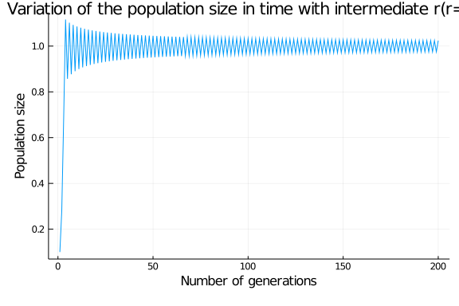
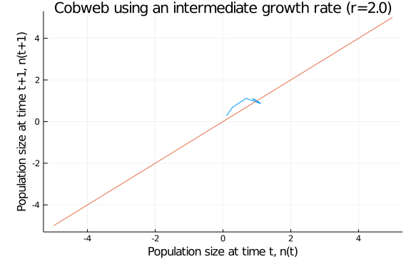

# Introduction

> Starting from the logistic model of growth with competition, you will (i)
> propose an analysis to show how we can find a vaalue of the growth rate *r*
> after which the population cannot persist (this will involve finding the
> maximum of a function, and then iterating this function enough times from this
> maximum), and (ii) plot the bifurcation diagram of the logistic model to show
> that there is indeed a maximal growth rate after which the system becomes
> unstable. Please note that you should not attempt to calculate this value by
> hand, but you may attempt to guess it based on the results of the second step.

In nature, the population size of any species will vary in time depending on mutiple factors (predation, resources, competition, climatic events, etc.). Models were developped to represent those variations. Among them, the logistic growth allows to describe the population size of a specie considering inderectly different parameters that affects the rate of growth (ex: the amount of resources limited implying that there is less resources as the population grows, higher predation pressure, higher disease incidence). 


## Required packages

````julia
using Plots
using Measures
````


## Model description and justification

<!-- Use this model, it assumes that K = 1, making the system dimensionless -->

We will use the following recursion equation of the logistic growth model:

$$n(t+1) = n(t) + r\times n(t)\times \left(1-\frac{n(t)}{K}\right)$$

Where $n(t)$ is variable representing the population size and $n(t+1)$ represent the size population for the next time step. The parameter *r* represent the intrinsect growth rate of the population and K represent the support capacity. To make the system dimensionless, we will assume that K = 1. The recursion equation then becomes:

$$n(t+1) = n(t) + r\times n(t)\times \left(1-n(t)\right)$$


## Model analysis

This model is a discrete time model, involving that an equilibrium is reached every time $n(t+1) = n(t)$. Knowing that the population size reaches a value equals to K at the equilibrium, to start the simulations we set 0 < $n(0)$ < K. The aim is to find a way to identify the value of the growth rate *r* where the population cannot persist, and to visually represent that in a bifurcation diagram.

To achieve that, we will represent the variation of the population size over time for different values of *r* to give an idea of how the model reacts. We will then represent graphically $n(t+1)$ in function of $n(t)$ on the same graph as a linear function, for diffrent values of *r*, to identify if the population reaches the equillibrium. This equilibrium is found when both functions intersect, meaning that there is no more variation in population size ($n(t+1) = n(t)$) Finally, the bifurcation diagram of this model will help to identify the value of *r* where the population goes instinct. 

## Simulations
### Growth rate after which the population cannot persist

To give us an insight of how the population size varies acording to the logistic growth model, we first represent the this variation for different values of *r*:

````julia
## Logistic growth function with low r

#creation of the logistic growth recursion equation
function logistic_growth(n::Float64, r::Float64)
    return (n+(r*n*(1-(n))))
end

#initialisation of the number of time steps and n(0)
pop_size = zeros(Float64, 200)
pop_size[1] = 0.1

#looping through time steps
for i in 2:length(pop_size)
    pop_size[i] = logistic_growth(pop_size[i-1], 0.7)
end

#generation of graphic representation
plot(pop_size, xaxis = "Number of generations", yaxis= "Population size", title = "Variation of the population size over time with a low r (r=0.7)", legend=:none, left_margin = 10mm, bottom_margin = 10mm)
````


We see that the population size is stabilizing at 1, the value of the capacity support. 

````julia
## Logistic growth function with intermediate r

#creation of the logistic growth recursion equation
function logistic_growth(n::Float64, r::Float64)
    return (n+(r*n*(1-(n))))
end

#initialisation of the number of time steps and n(0)
pop_size = zeros(Float64, 200)
pop_size[1] = 0.1

#looping through time steps
for i in 2:length(pop_size)
    pop_size[i] = logistic_growth(pop_size[i-1], 2.0)
end

#generation of graphic representation
plot(pop_size, xaxis = "Number of generations", yaxis= "Population size", title = "Variation of the population size in time with intermediate r(r=2.0)", legend=:none, left_margin = 10mm, bottom_margin = 10mm)
````





We see that for an intermadiate r, the population size osscillate between two values on both sides of the capacity support.

````julia
## Logistic growth function with high r

#creation of the logistic growth recursion equation
function logistic_growth(n::Float64, r::Float64)
    return (n+(r*n*(1-(n))))
end

#initialisation of the number of time steps and n(0)
pop_size = zeros(Float64, 200)
pop_size[1] = 0.1

#looping through time steps
for i in 2:length(pop_size)
    pop_size[i] = logistic_growth(pop_size[i-1], 3.0)
end

#generation of graphic representation
plot(pop_size, xaxis = "Number of generations", yaxis= "Population size", title = "Variation of the population size over time with a high r (r=3.0)", legend=:none, left_margin = 10mm, bottom_margin = 10mm)
````


We see that at r=3.0 the population size varies between many values, and is almost reaching the extinction ($n(t)$=0).

We then try to identify if the population reaches the equilibrium by representing $n(t+1)$ in function of $n(t)$, along with a linear function: 

````julia
## Reprensentation of n(t+1) in function of n(t)
#Cobweb Plots of the Logistic Equation
plot()

#logistic growth function
function logistic_growth(n::Float64, r::Float64)
    return (n + (r*n*(1.0-(n/1.0))))
end

#initialisation of time steps and n(0)
pop_size = zeros(Float64, 75)
pop_size[1] = 0.1

# low r
r = 0.7
for i in 2:length(pop_size)
    pop_size[i] = logistic_growth(pop_size[i-1], r)
end
plot(pop_size[1:(length(pop_size)-1)], pop_size[2:end], left_margin = 10mm, bottom_margin = 10mm)

#Linear function
y(x) = x
plot!(y, legend=:none, xaxis="Population size at time t, n(t)", yaxis ="Population size at time t+1, n(t+1)", title="Cobweb using a low growth rate (r=0.7)", left_margin = 10mm, bottom_margin = 10mm)
````


We see that at a low r, the logistic growth function crosses the linear function where the equilibrium is reach. 

````julia
## Reprensentation of n(t+1) in function of n(t)
#Cobweb Plots of the Logistic Equation
plot()

function logistic_growth(n::Float64, r::Float64)
    return (n + (r*n*(1.0-(n/1.0))))
end

pop_size = zeros(Float64, 75)
pop_size[1] = 0.1

# intermediate r
r = 2.0
for i in 2:length(pop_size)
    pop_size[i] = logistic_growth(pop_size[i-1], r)
end
plot(pop_size[1:(length(pop_size)-1)], pop_size[2:end], left_margin = 10mm, bottom_margin = 10mm)

#Linear function
y(x) = x
plot!(y, legend=:none, xaxis="Population size at time t, n(t)", yaxis ="Population size at time t+1, n(t+1)", title="Cobweb using an intermediate growth rate (r=2.0)", left_margin = 10mm, bottom_margin = 10mm)
````





For an intermediate r, the logistic growth function will oscillate before reaching the equilibrium. 

````julia
## Reprensentation of n(t+1) in function of n(t)
#Cobweb Plots of the Logistic Equation
plot()

function logistic_growth(n::Float64, r::Float64)
    return (n + (r*n*(1.0-(n/1.0))))
end

pop_size = zeros(Float64, 75)
pop_size[1] = 0.1

#high r
r = 3.0

for i in 2:length(pop_size)
    pop_size[i] = logistic_growth(pop_size[i-1], r)
end
plot(pop_size[1:(length(pop_size)-1)], pop_size[2:end], left_margin = 10mm, bottom_margin = 10mm)

#Linear function
y(x) = x
plot!(y, legend=:none, xaxis="Population size at time t, n(t)", yaxis ="Population size at time t+1, n(t+1)", title="Cobweb using a high growth rate (r=3.0)", left_margin = 10mm, bottom_margin = 10mm)
````


Finally, for a high value of r the system will never be able to reach the equilibrium. 


### Bifurcation diagram

The bifurcation can be scattered by iterating the recursion equation (here,
200 time steps were used) through diffrent values of *r* (here variating from 1 to 3 with steps of 0.001). The last 80th points of every simulation were then scattered in function of their corresponding *r*. 

````julia
## Creation of the Bifurcation Diagram

# Creation of the logistic growth function
function logistic_growth(n::Float64, r::Float64)
    return (n + (r*n*(1.0-n)))
end

#Creation of the bifurcation function
function bifurcation()
       # Creation of the variables
    pop_size = zeros(Float64, 200)
    pop_size[1] = 0.1

    growth_rate = collect(1:0.001:3)
    growth_rate_actual = zeros(Float64, 200)

    data_x = Float64[]
    data_y = Float64[]

    # Calculation of the population size for different values of r 
    for r in 1:0.001:3
        for i in 2:length(pop_size)
            pop_size[i] = logistic_growth(pop_size[i-1], r)
            growth_rate_actual[i-1] = r
            growth_rate_actual[i] = r
        end
        data_x = vcat(data_x, growth_rate_actual[181:200])
        data_y = vcat(data_y, pop_size[181:200])
    end

    # Scattering of the 80 last values of the population size, for all values of r
    scatter(data_x, data_y, fmt = :png, title = "Bifurcation diagram",
    xlabel = "Intrinsic growth rate (r)", ylabel ="Population sizes observed between t= 181 and 200", legend=:none, left_margin = 10mm, bottom_margin = 10mm) 
end

bifurcation()
````


## Conclusions

We have designed a simple method to identify and visualise at which intrinsic growth rate a population cannot persist, using the logistic growth model. By representing the varition of the population for diffrent values of *r*, we were able to see that the population starts to be unstable when *r* is above 2, and we saw that the population is almost instinct when *r* reaches 3. The bifurcation diagram confirmed this hypothesis, by showing that at r = 2, the first bifurcation arises, then the population size starts to vary between two values around the equilibrium. As *r* increases we see more bifurcations phenomenons, until the value 3 is reached, where the population size reaches zero, and cannot persist anymore. 
