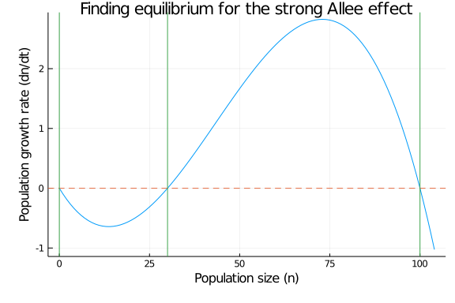

# Introduction


<!--Under the Allee effect, the growth of a population is reduced at low densities. Using the strong and the weak Allee effect models as indicated below, find the equilibrium through calculations, then confirm these using a graphical technique. Finally, write an ordinary differential equations model for the strong Allee effect, and verify that populations starting on different sides of the equilibrium do end up where they are predicted.-->

Under the Allee effect, the growth of a population is reduced at low densities.
This is explained by the fact that there is a positive correlation between the population size and the fitness (survival rate, reproductivity, etc.) of an individual; implying a positive correlation between the growth rate per capita and the population size over a certain determined interval. This phenomenon can be present in certain species and usually always for small effectives. The cooperative behavior in species is an example of factor explaining a better fitness at higher sizes of population, increasing the chance of surviving and feeding.  

The strong Allee effect arise when there is a critical density of the population size. When the population size is under this critical point, the growth rate per capita becomes negative and the population eventually won't be able to persist. 

The weak Allee effect arise when there is no critical density of the population size. Assuming this, the growth rate per capita is always positive and varies as mentionned earlier. 

In this work we will analyse the equilibriums of both Allee effects and we will then verify with a graphical representation that the population size starting from each sides of the equilibriums will end up where it is predicted. 

# Required packages

````julia
using Plots
using DifferentialEquations
using Measures
````


# Model description and justification

We will first start the implementation of the Allee effect model with the logistic growth model of population size in continuous time, where the population growth rate is represented as:

$$\frac{\text{d}}{\text{d}t}n = n\times r\times \left(1-\frac{n}{K}\right)$$

In this equation, $n$ represents the population size at time $t$, $r$ represents the intrinsec growth rate of the population and $K$ represents the support capacity of the population. To obtain the strong Allee effect model, we then multiply this equation by $\left(\frac{n}{A}-1\right)$ to obtain the following equation:

<!-- Use the two models for the strong and weak Allee effect, respectively -->

$$\frac{\text{d}}{\text{d}t}n = n\times r\times \left(\frac{n}{A}-1\right)\times \left(1-\frac{n}{K}\right)$$

where $A$ represents the critical size of the population.

To obtain the weak Allee effect model, we multiply the logistic equation by $\left(\frac{n}{K}\right)$, to obtain the following equation:

$$\frac{\text{d}}{\text{d}t}n = \frac{r}{K}n^2\times \left(1-\frac{n}{K}\right)$$

 
# Model analysis

Let's find the equilibrium of this model through calculations. Knowing that this model is in continuous time, to find the equilibrium we will calculate the value of the population size $\hat n$ for which the derivative of the population size in time is equal to zero.

## Strong Allee effect

To find the equilibrum of the strong Allee effect, we will search the values of $n$ for which :

$$\frac{\text{d}}{\text{d}t}n = \hat n\times r\times \left(\frac{\hat n}{A}-1\right)\times \left(1-\frac{\hat n}{K}\right) = 0$$

The first solution implies that $$\hat n_1 = 0$$. The second solution implies that $$\left(\frac{\hat n_2}{A}-1\right) = 0$$, giving $$\hat n_2 = A$$. The third solution implies that $$\left(1-\frac{\hat n_3}{K}\right) = 0$$ giving $$\hat n_3 = K$$.

## Weak Allee effect

To find the equilibrum of the weak Allee effect, we will search the values for which :

$$\frac{\text{d}}{\text{d}t}n = \frac{r}{K}\hat n^2\times \left(1-\frac{\hat n}{K}\right) = 0$$

The first solution implies that $$\hat n_1 = 0$$. The second solution implies that $$\left(1-\frac{\hat n_2}{K}\right)$$ $$\hat n_2 = K$$.

# Simulations

We will now confirm those equilibrium for both models with graphical techniques:

## Strong Allee effect equilibrium

Starting with the simulation of the strong Allee effect:

````julia
"""
This function generates the strong Allee effect, by taking the initial population size n0, different parameters p and a time vector t
"""
function allee_strong(n0, p, t)
    n = n0
    dn_dt_n_strong = n*p.r*((((n/p.A)-1))*(1-(n/p.K)))
    return(dn_dt_n_strong)
end

# Defining the initial population sizes
n0 = 10.0

# Defining the time lapse t0 - t end
t=(0., 500.)

# Defining the parameters (growth rate, critical size population and support capacity)
p = (r = 0.1, A = 30, K = 100)

# Generating the varations of the population for different sizes of population varying from 0 to above the support capacity
dn_dt_n_strong_vec = zeros(Float64, p.K+5)
n_vec = 0:p.K+4
for i in 1:p.K+5
    dn_dt_n_strong_vec[i] = allee_strong(n_vec[i], p, t)
end

# Plotting the (dn/dt) in function of n(t) graph for the strong Allee effect
plot(n_vec, dn_dt_n_strong_vec, title="Finding equilibrium for the strong Allee effect", xlabel="Population size (n)", ylabel="Population growth rate (dn/dt)", legend =false, left_margin = 10mm, bottom_margin = 10mm)

# Adding horizontal line where dn/dt = 0
hline!([0], ls=:dash)

# Adding vertical line for the values of n where the equilibrum should be reach
vline!([0, p.K, p.A])
````





The green vertical lines were placed where the equilibriums were expected to be reached. Knowing that this situation arises when dn/dt = 0 (dashed line), we can graphically see that the three values that were determined earlier ($\hat n_1 = 0, \hat n_2 = A, \hat n_3 = K$) are effectively equilibriums. We can also graphically see the impact of the Allee effect on the growth rate; for a size of population varying between 0 and the critical size $A$, the population is diminishing (i.e $\frac{\text{d}}{\text{d}t}n \leq 0$) toward extinction, whereas the population size is growing (i.e $\frac{\text{d}}{\text{d}t}n \\geq 0$) towards the support capacity when it is situated between the critical size $A$ and the support capacity $K$. 

## Weak Allee effect equilibrium

Now, simulating the weak Allee effect:

````julia
"""
This function generates the strong Allee effect, by taking the initial population size n0, different parameters p and a time vector t
"""
function allee_weak(n0, p, t)
    n=n0
    dn_dt_n_weak = (p.r*(n^2)/p.K)*(1-(n/p.K))
    return(dn_dt_n_weak)
end

# Generating the varations of the population for different sizes of population varying from 0 to above the support capacity
dn_dt_n_weak_vec = zeros(Float64, p.K+5)
n_vec = 0:p.K+4
for i in 1:p.K+5
    dn_dt_n_weak_vec[i] = allee_weak(n_vec[i], p, t)
end

# Plotting the (dn/dt) in function of n(t) graph for the weak Allee effect
plot(n_vec, dn_dt_n_weak_vec, title="Finding equilibrium for the weak Allee effect", xlabel="Population size (n)", ylabel="Population growth rate (dn/dt)", legend =false, left_margin = 10mm, bottom_margin = 10mm)

# Adding horizontal line where dn/dt = 0
hline!([0], ls=:dash)

# Adding vertical line for the values of n where the equilibrum should be reached
vline!([0, p.K])
````


Again, the green vertical lines were placed where the equilibriums were excepted to be reached. Knowing that this situation arise when dn/dt = 0 (dashed line), we can graphically see that the equilibriums are reached when dn/dt = 0 for each of the two values that were determined earlier ($\hat n_1 = 0, \hat n_2 = K$). We can also graphically see that there is no critical population size under which the population is downsizing. For a size of population varying between 0 and the support capacity $K$, the population is growing (i.e $\frac{\text{d}}{\text{d}t}n \\geq 0$), and will diminish when the support capacity is reached and surpass.

## ODE model for Strong Allee effect

We will now write an ordinary diffrential equation for the Strong Allee effect and then we will verify that different populations starting on different sides of the equilibrium will end up where predicted. 

````julia
# Defining the ordinary diffrential equation (ODE) problems for different initial population sizes, starting from all sides of equilibrium
prob_strong1 = ODEProblem(allee_strong, 0.0, t, p) #n0 corresponding to the first equilibrium
prob_strong2 = ODEProblem(allee_strong, 20.0, t, p) #n0 starting between the first and second equilibrium
prob_strong3 = ODEProblem(allee_strong, 55.0, t, p) #n0 starting between the second and third equilibrium
prob_strong4 = ODEProblem(allee_strong, 30.0, t, p) #n0 corresponding to the second equilibrium
prob_strong5 = ODEProblem(allee_strong, 100.0, t, p) #n0 corresponding to the third equilibrium
prob_strong6 = ODEProblem(allee_strong, 110.0, t, p) #n0 starting above the last equilibrium
    
# Resolving the ODE problems and plotting them for each cases
solution_strong1 = solve(prob_strong1)
plot(solution_strong1, label ="Initial population size: 0 ", c=:orange) #n0 corresponding to the first equilibrium

solution_strong2 = solve(prob_strong2)
plot!(solution_strong2, label ="Initial population size: 20 ", c=:blue) #n0 starting between the first and second equilibrium

solution_strong3 = solve(prob_strong3)
plot!(solution_strong3, label ="Initial population size: 55 ", c=:red)  #n0 starting between the second and third equilibrium

solution_strong4 = solve(prob_strong4)
plot!(solution_strong4, label ="Initial population size: 30 ", c=:green) #n0 corresponding to the second equilibrium

solution_strong5 = solve(prob_strong5)
plot!(solution_strong5, label ="Initial population size: 100 ", c=:purple) #n0 corresponding to the third equilibrium

solution_strong6 = solve(prob_strong6)
plot!(solution_strong6, label ="Initial population size: 110 ", xlim=(0,200), c=:pink, xlabel = "Time", ylabel ="Population size (n)", title="Simulations for the strong Allee effect", left_margin = 10mm, bottom_margin = 10mm) #n0 starting above the last equilibrium
````


We can see from the graph above that every simulation ends up where predicted, no matter on which side of the equilibrium it starts. The simulations starting with a population size corresponding to an equilibrium for the strong Allee effect ($n=0$, $n=A$, $n=K$) do not vary and stay at equilibrium over time. In the strong Allee effect, the population starting between 0 and the critical size $A$ is expected to diminish until reaching extinction (i.e $n=0$). With the blue line, we can graphically see that this is the case. The population starting between the critical size $A$ and the support capacity $K$ is expected to grow until it reaches the support capacity ($n=K$). This is confirmed by the red line. Finally, a population starting above the support capacity is expected to be downsizing until reaching the support capacity ($n=K$). This is confirmed by the pink line. 

# Conclusions

We have designed a model for both strong and weak Allee effect. In the strong Allee effect, we identified three population sizes equilibriums, corresponding to 0, to the critical size $A$ and to the support capacity $K$. For the population to grow, we have identified that the population size must be situated between $A$ and $K$, otherwise, it diminishes, except for the equilibrium values. For the weak Allee effect, we identified two equilibriums, corresponding to 0 and the support capacity $K$. For the population to grow, we have identified that the population size must be situated between $0$ and $K$. In the final section, we showed that regardless of the initial population size, the system always lead to its equilibriums. 


