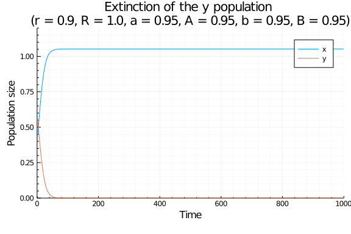
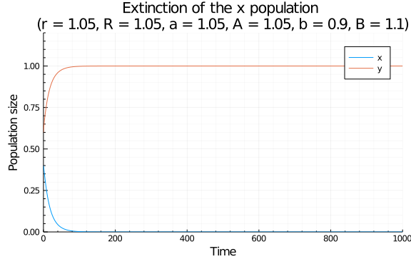
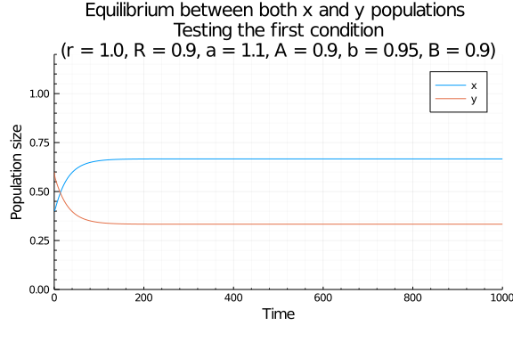
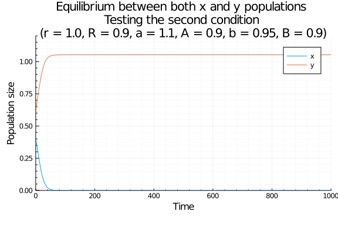

# Introduction

<!--Using the logistic model of growth for two populations with both intra and
inter-specific competition, find the expression of the zero-growth isoclines,
then define when the equilibriums with 1 and 2 species are feasible. When this
is done, simulate this system as an ordinary differential equations problem,
under three or four combinations of parameters, to show that the system
behaves as predicted. There are various ways to formulate the model, either
using a global carrying capacity for the population, or using four different
competition terms (for intra and inter-specific competition).-->

When two populations are competing for the same limited ressources, they are both exposed to intraspecific competition, as described by the logistic model of growth, but they are also affected by interspecific competition. The growth rates of those populations are therefore negatively influenced by both the rate of encounters between individuals of the same specie as well as the one between individuals from different species. The interaction between those two groups can either lead to the extinction of one or another, but it can also lead to the coexistence of both species. Those outcomes will depend on the relative parameters, including growth rates, inter-specific competition coefficients and intra-specific competition coefficients, describing their interactions. 

In this work, we will first identify the zero-growth isoclines for both populations, and analyse when the equilibriums, either with one or two species, are feasible. We will then simulate this model with different parameters combinations to show that its behavior acts as predicted. 

# Required packages

````julia
using Plots
using DifferentialEquations
using Measures
````


# Model description and justification

The logistic model of growth for two populations ($x$ and $y$) with both intra and inter-specific competition can be expressed with the following equations:

$$\frac{\text{d}x}{\text{d}t} = R\times x - A\times x^2 - B\times x\times y$$

$$\frac{\text{d}y}{\text{d}t} = r\times y - a\times y^2 - b\times x\times y$$

where $\frac{\text{d}x}{\text{d}t}$ and $\frac{\text{d}y}{\text{d}t}$ represent the growth rate of the populations, where $R$ and $r$ represent the intrinsec growth rate for the $x$ and $y$ populations respectively. The parameters $A$ and $B$ are respectively the intraspecific and interspesific coefficients for the $x$ population. The parameters $a$ and $b$ are the the intraspecific and interspecific coefficients for the $y$ population. All of thoses coefficients are positives. 

We can see that both populations growth rate will increase in regards of the following terms: ($R \times x$) for the $x$ population and ($r \times y$) for the $y$ population. Those terms represent the assumed intrinsic exponential growth of the species when there is no competition.

On the other hand, both populations growth rate will decrease in regards to the following terms: ($A\times x^2$), ($B\times x\times y$) for the $x$ population and ($a\times y^2$), ($b\times x\times y$) for the $y$ population. Those terms represents respectively the impact of the intra and inter specific competition. 

# Model analysis

## Expression of the zero-growth isoclines

The zero-growth isoclines correspond to the curve along which the variation of one of the population is equal to zero. 

Hence, we can find the isocline for the $x$ population by first posing: $\frac{\text{d}x}{\text{d}t} \frac{1}{x} = 0$. We then obtain:

$$R - A\times x - B\times y = 0$$

By isolating $y$ from this, we obtain the expression of the zero-growth isocline for the $x$ population, given by:

$$ y = \frac{-A}{B}x + \frac{R}{B} $$

We can then find the isocline for the $y$ population by posing: $\frac{\text{d}y}{\text{d}t} \frac{1}{y} = 0$. We then obtain:

$$r - a\times y - b\times x = 0$$

By isolating $y$ from this, we obtain the expression of the zero-growth isocline for the $y$ population, given by:

$$ x = \frac{-b}{a}x + \frac{r}{a} $$
 
 
## Equilibriums

We now find the equilibriums of this model. To achieve this, we have to find the values of both population sizes at equilibrium ($\hat x$ and $\hat y$) for which there is no more variation of size (i.e $\frac{\text{d}x}{\text{d}t} = 0$ and $\frac{\text{d}y}{\text{d}t} = 0$):

$$\frac{\text{d}x}{\text{d}t} = R\times x - A\times x^2 - B\times x\times y = 0$$

$$\frac{\text{d}y}{\text{d}t} = r\times y - a\times y^2 - b\times x\times y = 0$$

We can re-express those equations to find more easily the equilibriums :

$$\frac{\text{d}x}{\text{d}t} = x\times [R - A\times x - B\times y] = 0$$

$$\frac{\text{d}y}{\text{d}t} = y\times [r - a\times y - b\times x] = 0$$

The **first equilibrium** arises with $\hat x_1 = 0$ and $\hat y_1 = 0$.

If we then consider that the $y$ population goes extinct($y=0$):

$$\frac{\text{d}x}{\text{d}t} = x\times [R - A\times x] = 0$$

$$\frac{\text{d}x}{\text{d}t} = [R - A\times x] = 0$$

we can find the **second equilibrium** at $\hat x_2 = \frac{R}{A}$ and $\hat y_2 = 0$.

If we then consider that the $x$ population goes extinct ($x=0$):

$$\frac{\text{d}y}{\text{d}t} = y\times [r - a\times y] = 0$$

$$\frac{\text{d}y}{\text{d}t} = [r - a\times y] = 0$$

we can find the **third equilibrium** at $\hat x_3 = 0$ and $\hat y_3 = \frac{r}{a}$.

Finally, we can find the last equilibrium with the following:

$$[R - A\times x - B\times y] = 0$$ 

and 

$$[r - a\times y - b\times x] = 0$$

If we isolate $x$ from the first equation we obtain:

$$x = [\frac{R-B\times y}{A}]$$

If we replace the expression of $x$ in the second equation we obtain:

$$[r - a\times y - b\times \frac{R-B\times y}{A}] = 0$$

giving as the **fourth equilibrium** $\hat x_4 = \frac{r\times B - R\times a}{B\times b - A\times a}$ and $\hat y_4 = \frac{R\times b - r\times A}{B\times b - A\times a}$.

## Equilibrium feasibility analysis

We will now find when the equilibrium with 1 and 2 species are feasible. For the equilibriums to be feasible, their values have to be positive (i.e greater or equal to zero).

The **first equilibrium** ($\hat x_1 = 0$ and $\hat y_1 = 0$) is always feasible since its values are always equal to zero.

The **second equilibrium** ($\hat x_2 = \frac{R}{A}$ and $\hat y_2 = 0$) is feasible if $\frac{R}{A} \geq 0$, which is always true since $R$ and $A$ are coefficients that are always positive. 

The **third equilibrium** ($\hat x_3 = 0$ and $\hat y_2 = \frac{r}{a}$) is feasible if $\frac{r}{a} \geq 0$, which is always true since $r$ and $a$ are always positive. 

The **fourth equilibrium** ($\hat x_4 = \frac{r\times B - R\times a}{B\times b - A\times a}$ and $\hat y_4 = \frac{R\times b - r\times A}{B\times b - A\times a}$) is feasible if the numerator and the denominator of these terms have the same signs. If we consider negative signs, we obtain the following inequations: 

$$ Bb < Aa $$

$$ rB < Ra $$

$$ Rb < rA $$

Giving us the first condition that leads to the fourth equilibrium to be feasible:

$$ \frac{b}{A} < \frac{r}{R} < \frac{a}{B}$$

If we now consider positives signs, we obtain the following inequations: 

$$ Bb > Aa $$

$$ rB > Ra $$

$$ Rb > rA $$

Giving us the second condition that leads to the fourth equilibrium to be feasible:

$$ \frac{a}{B} < \frac{r}{R} < \frac{b}{A}$$

# Simulations

We will now simulate this model as an ordinary differential equation problem, under four combination of parameters. Let's start with the definition of the model:

````julia
"""
This function defines the logistic growth model with competition, by taking in argument the initial population sizes, the parameters p, and time.
"""

function competition(u0, p, t)
    x, y = u0 # Initial populations sizes
    dx = p.R*x - p.A*x*x - p.B*x*y # variation of the x population
    dy = p.r*y - p.a*y*y - p.b*x*y # variation of the y population
    return [dx, dy]
end

# Initial conditions definition:
u0 = [0.4, 0.6] # Initial population sizes 
t = (0., 1000.) # t0 - t end
````


````
(0.0, 1000.0)
````


Now, let's create the different functions that we will need to analyse this model:

````julia
"""
This function calculates the population sizes when an equilibrium between both population is possible, according to the selected parameters.
"""
function eq_2_sp(p) 
    w = p.B*p.b-p.A*p.a
    x̂ = (p.r*p.B - p.R*p.a)/w
    ŷ = (p.R*p.b - p.r*p.A)/w 
    return (x̂, ŷ)
end

"""
This function calculates the population sizes when only x survives, according to the selected parameters.
"""
function eq_1_sp_x(p)
    x̂ = (p.R/p.A)
    ŷ = 0
    return (x̂, ŷ)
end

"""
This function calculates the population sizes when only y survives, according to the selected parameters.
"""
function eq_1_sp_y(p)
    x̂ = 0
    ŷ = (p.r/p.a) 
    return (x̂, ŷ)
end
````


````
Main.##WeaveSandBox#402.eq_1_sp_y
````


Now, we will define different functions that will serve to class the parameters combinaisons, according to the equilibrium that they will produce. 

````julia
"""
This function is keeping the parameters allowing only x to survive. 

For the survival of only the x specie, we will choose to keep the combinations of parameters with the following method:

- Keeping all competition coefficients equals, we will choose the combination allowing r < R.

- Keeping all the inter-specific competition and growth rate coefficients equals, we will choose the combination allowing A < a.

- Keeping all the intra-specific competition and growth rate coefficients equals, we will choose the combination allowing B < b.

- Removing all the combinations leading to an equilibrium.
"""

eq_1_sp_exists_x(p) = ((p.r < p.R) & (p.a == p.A == p.b == p.B) | (p.A < p.a) & (p.r == p.R == p.b == p.B) | (p.B < p.b) & (p.a == p.A == p.r == p.R)) & ~ (p.b/p.A < p.r/p.R < p.a/p.B) & ~ (p.a/p.B < p.r/p.R < p.b/p.A) 

"""
This function is keeping the parameters allowing only y to survive. 

For the survival of only the y species, we will choose to keep the combinations of parameters with the following method:

- Keeping all competition coefficients equals, we will choose the combination allowing R < r.

- Keeping all the inter-specific competition and growth rate coefficients equals, we will choose the combination allowing a < A.

- Keeping all the intra-specific competition and growth rate coefficients equals, we will choose the combination allowing b < B.

- Removing all the combinations leading to an equilibrium.
"""

eq_1_sp_exists_y(p) = ((p.R < p.r) & (p.a == p.A == p.b == p.B) | (p.a < p.A) & (p.r == p.R == p.b == p.B) | (p.b < p.B) & (p.a == p.A == p.r == p.R)) & ~ (p.b/p.A < p.r/p.R < p.a/p.B) & ~ (p.a/p.B < p.r/p.R < p.b/p.A)

"""
This function is keeping the parameters allowing both x and y to survive, according to the first condition of equilibrium identified previously.
"""

eq_2_sp_exists(p) =  (p.b/p.A < p.r/p.R < p.a/p.B) #keeping the parameters allowing both x and y to survive, according to the first condition of equilibrium

"""
This function is keeping the parameters allowing both x and y to survive, according to the second condition of equilibrium identified previously.
"""
eq_2_sp_exists2(p) =   (p.a/p.B < p.r/p.R < p.b/p.A) #keeping the parameters allowing both x and y to survive, according to the second condition of equilibrium
````


````
Main.##WeaveSandBox#402.eq_2_sp_exists2
````


We will now create a grid to generate all the possible combinations of the 6 parameters, and we will filter them according to the functions defined above. 

````julia
# Grid for the search 
possible_values = 0.9:0.05:1.1

# Empty array for parameter values 
p_combin = []

# Grid search, generating all the combinations of parameters
for r in possible_values, R in possible_values
    for a in possible_values, A in possible_values
        for b in possible_values, B in possible_values
            p = (r=r, R=R, a=a, A=A, b=b, B=B)
            push!(p_combin, p) 
        end
    end
end

# Keeping only parameters corresponding to our criteria for different outcomes
p_xy = filter(eq_2_sp_exists, p_combin)
p_xy2 = filter(eq_2_sp_exists2, p_combin)
p_x = filter(eq_1_sp_exists_x, p_combin)
p_y = filter(eq_1_sp_exists_y, p_combin)
````


````
110-element Array{Any,1}:
 (r = 0.9, R = 0.9, a = 0.9, A = 0.9, b = 0.9, B = 0.95)    
 (r = 0.9, R = 0.9, a = 0.9, A = 0.9, b = 0.9, B = 1.0)     
 (r = 0.9, R = 0.9, a = 0.9, A = 0.9, b = 0.9, B = 1.05)    
 (r = 0.9, R = 0.9, a = 0.9, A = 0.9, b = 0.9, B = 1.1)     
 (r = 0.9, R = 0.9, a = 0.9, A = 0.95, b = 0.9, B = 0.9)    
 (r = 0.9, R = 0.9, a = 0.9, A = 1.0, b = 0.9, B = 0.9)     
 (r = 0.9, R = 0.9, a = 0.9, A = 1.05, b = 0.9, B = 0.9)    
 (r = 0.9, R = 0.9, a = 0.9, A = 1.1, b = 0.9, B = 0.9)     
 (r = 0.95, R = 0.9, a = 0.9, A = 0.9, b = 0.9, B = 0.9)    
 (r = 0.95, R = 0.9, a = 0.95, A = 0.95, b = 0.95, B = 0.95)
 ⋮                                                          
 (r = 1.1, R = 1.05, a = 1.1, A = 1.1, b = 1.1, B = 1.1)    
 (r = 1.1, R = 1.1, a = 0.9, A = 1.1, b = 1.1, B = 1.1)     
 (r = 1.1, R = 1.1, a = 0.95, A = 1.1, b = 1.1, B = 1.1)    
 (r = 1.1, R = 1.1, a = 1.0, A = 1.1, b = 1.1, B = 1.1)     
 (r = 1.1, R = 1.1, a = 1.05, A = 1.1, b = 1.1, B = 1.1)    
 (r = 1.1, R = 1.1, a = 1.1, A = 1.1, b = 0.9, B = 1.1)     
 (r = 1.1, R = 1.1, a = 1.1, A = 1.1, b = 0.95, B = 1.1)    
 (r = 1.1, R = 1.1, a = 1.1, A = 1.1, b = 1.0, B = 1.1)     
 (r = 1.1, R = 1.1, a = 1.1, A = 1.1, b = 1.05, B = 1.1)
````


Finally, we will choose a random combination of parameters corresponding to each different scenarios, we will define the ordinary differential equation problem corresponding and resolve it.

````julia
# Choosing random parameters among the possible ones for all the scenarios
rand_p_x = rand(p_x) 
rand_p_y = rand(p_y) 
rand_p_xy = rand(p_xy) 
rand_p_xy2 = rand(p_xy2) 

# Definition of problems
prob_x = ODEProblem(competition, u0, t, rand_p_x) # only x survives
prob_y = ODEProblem(competition, u0, t, rand_p_y) # only y survives
prob_xy = ODEProblem(competition, u0, t, rand_p_xy) # both species survive, under the first condition
prob_xy2 = ODEProblem(competition, u0, t, rand_p_xy2) #both species survive, under the second condition

# Resolution of problems
solution_x = solve(prob_x)
solution_y = solve(prob_y)
solution_xy = solve(prob_xy)
solution_xy2 = solve(prob_xy2)
````


````
retcode: Success
Interpolation: Automatic order switching interpolation
t: 55-element Array{Float64,1}:
    0.0                
    0.19442543756167963
    0.7019434135928955 
    1.3827930395145986 
    2.238889022485992  
    3.322599301568661  
    4.675469682560605  
    6.3950863889912295 
    8.637520579740592  
   12.088010089573885  
    ⋮                  
  149.67555975488935   
  161.25130813881904   
  176.1408325082924    
  196.4893141836972    
  227.19661183490263   
  285.24149068324425   
  402.12500224422024   
  673.922720741245     
 1000.0                
u: 55-element Array{Array{Float64,1},1}:
 [0.4, 0.6]                                   
 [0.3990345790491776, 0.6055945345551279]     
 [0.3950740759988867, 0.6183574540273379]     
 [0.38759635810199566, 0.6326859935535305]    
 [0.37631573045418537, 0.6482721166293719]    
 [0.36069845255800453, 0.6663124894876933]    
 [0.34044481856498043, 0.6879407467475817]    
 [0.31443434948557886, 0.7150621237582722]    
 [0.2808132785411176, 0.7500827911087211]     
 [0.23105661545083717, 0.8023327130937777]    
 ⋮                                            
 [2.6781581027999205e-7, 1.052631280501608]   
 [7.486079419743776e-8, 1.0526314955247826]   
 [1.3111893141923706e-8, 1.0526315643358752]  
 [6.81250394992912e-10, 1.0526315781882043]   
 [-5.626039151221329e-11, 1.0526315790100624] 
 [1.0958956373352776e-11, 1.0526315789351557] 
 [-2.135036893288993e-12, 1.0526315789497473] 
 [2.679666881902772e-13, 1.0526315789470704]  
 [-2.9538589086549263e-14, 1.0526315789474008]
````


The last step of this simulation will allows us to calculate the expected final populations sizes for the different outcomes for this model, and to graphically visualize if the model is effectively acting as predicted. 

### Simulation 1: x survives, y goes extinct

````julia
print("Expected value of (x̂,ŷ): $(eq_1_sp_x(rand_p_x))")
````


````
Expected value of (x̂,ŷ): (1.0526315789473684, 0)
````


````julia

# Ploting the solution 
p1 = plot(solution_x, title = "Extinction of the y population \n$(rand_p_x)", xlab="Time", ylab="Population size")
plot(p1, lab=["x" "y"], ylim=(0,1.2), minorgrid=true, left_margin = 10mm, bottom_margin = 10mm)
````





In the graph above, we can see that the model reacts as predicted. When all parameters are kept constant and equal, except for two, the population with the smaller growth rate or the higher competition coefficient (here the $y$ population) will go extinct. When comparing the surviving population size to the expected value ($\frac{R}{A}$), we can see they correspond. 

### Simulation 2: x goes extinct, y survives 

````julia
print("Expected value of (x̂,ŷ): $(eq_1_sp_y(rand_p_y))")
````


````
Expected value of (x̂,ŷ): (0, 1.0)
````


````julia

# Ploting the solution 
p2 = plot(solution_y, title = "Extinction of the x population \n$(rand_p_y)", xlab="Time", ylab="Population size")
plot(p2, lab=["x" "y"], ylim=(0,1.2), minorgrid=true, left_margin = 10mm, bottom_margin = 10mm)
````





In the graph above, we can see that the model react as predicted. When all parameters are kept constant and equal, except for two, the population with the smaller growth rate or the higner competition coefficient (here the $x$ population) will go extinct. When comparing the surviving population size to the expected value ($\frac{r}{a}$), we can see they correspond. 

### Simulation 3: both populations are expected to survive (first condition)

````julia
print("Expected value of (x̂,ŷ): $(eq_2_sp(rand_p_xy))")
````


````
Expected value of (x̂,ŷ): (0.6666666666666666, 0.3333333333333333)
````


````julia

# Ploting the solution 
p3 = plot(solution_xy, title = "Equilibrium between both x and y populations \nTesting the first condition\n$(rand_p_xy)", xlab="Time", ylab="Population size")
plot(p3, lab=["x" "y"], ylim=(0,1.2), minorgrid=true, left_margin = 10mm, bottom_margin = 10mm)
````





In the graphic above, we can see that the model react as predicted. When the selected parameters respect the first condition of equilibrium ($ \frac{b}{A} < \frac{r}{R} < \frac{a}{B}$), both population survive. When comparing the equilibrium population sizes to the expected values ($\hat x_4 = \frac{rB - Ra}{Bb - Aa}$ and $\hat y_4 = \frac{Rb - rA}{Bb - Aa}$), we can see they correspond.


### Simulation 4: both populations are expected to survive (second condition)

````julia
print("Expected value of (x̂,ŷ): $(eq_2_sp(rand_p_xy2))")
````


````
Expected value of (x̂,ŷ): (1.0263157894736847, 0.026315789473683657)
````


````julia

# Ploting the solution 
p4 = plot(solution_xy2, title = "Equilibrium between both x and y populations \nTesting the second condition \n$(rand_p_xy)", xlab="Time", ylab="Population size")
plot(p4, lab=["x" "y"], ylim=(0,1.2), minorgrid=true, left_margin = 10mm, bottom_margin = 10mm)
````





In the graph above, we can see that the model does not react as predicted. When the selected parameters respect the second condition of equilibrium ($ \frac{a}{B} < \frac{r}{R} < \frac{b}{A}$), one population goes extinct. When comparing the equilibrium population sizes to the expected values ($\hat x_4 = \frac{rB - Ra}{Bb - Aa}$ and $\hat y_4 = \frac{Rb - rA}{Bb - Aa}$), we can see they do not correspond. 

From the results obtained in the two last simulations, we can do the hypothesis that the first condition of equilibrium between the two species leads to a stable equilibrium, whereas the second condition must leads to an unstable equilibrium point. A stability analysis would be interesting to build to confirm those hypothesis. 

# Conclusions

We have designed an analysis of the logistic model of growth for two populations with both intra and inter-specific competition. We first identified the zero-growth population isoclines and we found the population sizes at equilibriums. This allowed us to see that this model can generate different equilibriums in terms of surviving population, population sizes and stability, varying accordingly to the relative combination of parameters, including the growth rate, the intra-specific competition coefficient and the inter-specific competition coefficient. From this study, we can see that this model can easily help us to evaluate the potential of the coexsistence between two competing species. 

