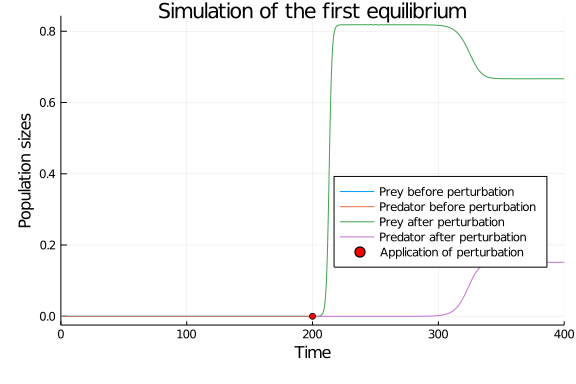
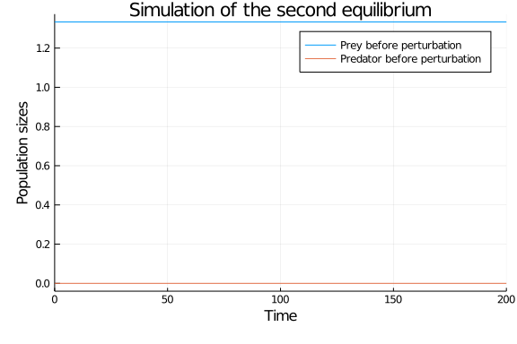
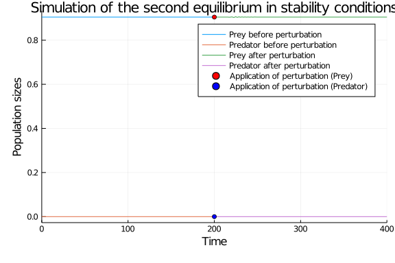
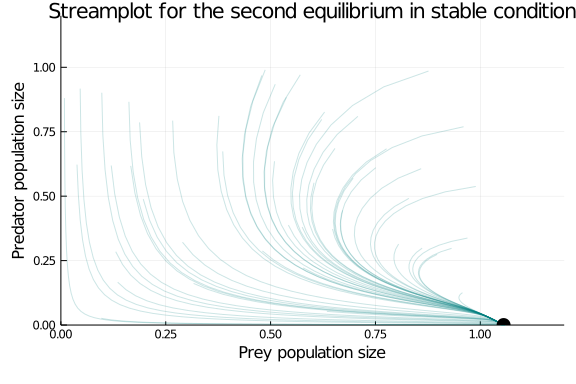
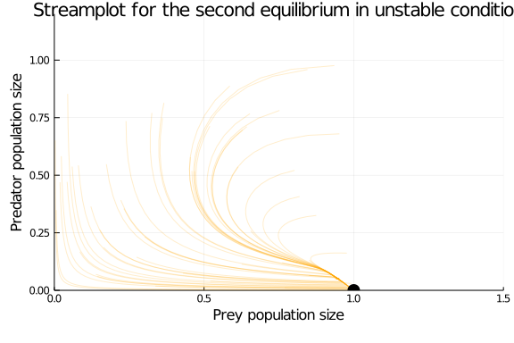
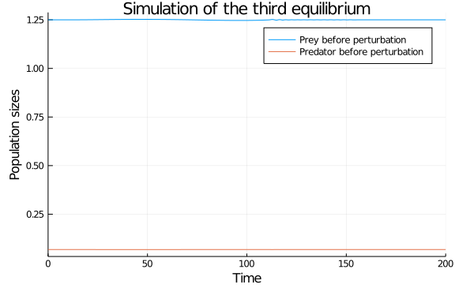
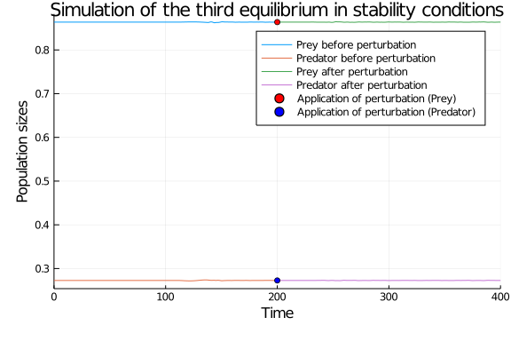
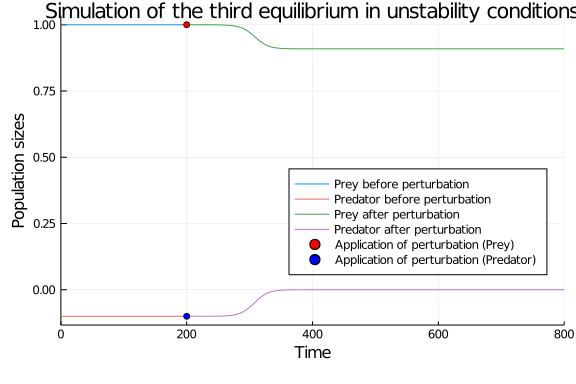
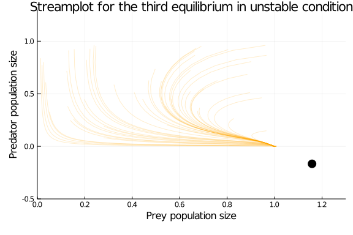

# Introduction

<!--Using the model for predators and preys seen in class, discuss the stability of the different equilibriums, and test your analytical results by performing simulations in which the population sizes are moved away from the equilibrium by a small amount.-->

The dynamic of a population of preys in relation with the population of its predators is defined by different factors. The intrinsec growth rate of the prey contribute to the augmentation of its population size, but the intra-specific competition inside of their population, and the consumption rate by the predators, diminish the exponential growth rate of the preys. On the other side, the predators population is positively influenced by their encounters and consumption of the preys, and negatively influenced by their death rate. The relation between the coefficients defining those dynamics will then determine if the coexistence between preys and predators is possible. 

In this work, we will first identify the equilibriums points between the prey and the predator's population. We will then define the stability of those equilibriums, and test it by simulating populations at equilibrium and moving them away from it by a small amount.

## Required packages

````julia
using Plots
using DifferentialEquations
using Measures
````


# Model description and justification

The model for predators and preys can be expressed with the following equations:

$$\frac{\text{d}x}{\text{d}t} = r\times x - \alpha\times x^2 - \beta\times x\times y$$

$$\frac{\text{d}y}{\text{d}t} = \gamma\times x\times y - \delta\times y$$

where $\frac{\text{d}x}{\text{d}t}$ and $\frac{\text{d}y}{\text{d}t}$ represent the growth rate of the prey and predator populations respectively, where $r$ represent the intrinsec growth rate for the prey, $\alpha$ represent their intraspecific competition coefficient and $\beta$ represent their consomation rate by the predators. The parameters $\gamma$ represent the intrinsec growth rate of the predator, according to its consumation of preys, and $\delta$ is the death rate of the predators. All of thoses coefficients are positives. 


# Model analysis

## Finding the equilibriums

We will now find the equilibriums for this continuous model. To achieve this, we have to find the values of both population sizes at equilibrium ($\hat x$ and $\hat y$) for which there is no more variation of size (i.e $\frac{\text{d}x}{\text{d}t} = 0$ and $\frac{\text{d}y}{\text{d}t} = 0$):

$$\frac{\text{d}x}{\text{d}t} = r\times x - \alpha\times x^2 - \beta\times x\times y = 0$$

$$\frac{\text{d}y}{\text{d}t} = \gamma\times x\times y - \delta\times y = 0$$

We can re-express those equations to find more easily the equilibriums :

$$\frac{\text{d}x}{\text{d}t} = x\times [r - \alpha\times x - \beta\times y] = 0$$

$$\frac{\text{d}y}{\text{d}t} = y\times [\gamma\times x - \delta] = 0$$

The **first equilibrium** arises with $\hat x_1 = 0$ and $\hat y_1 = 0$.

If we then consider that the predator population goes extinct($y=0$), we obtain:

$$\frac{\text{d}x}{\text{d}t} = x\times [r - \alpha\times x] = 0$$

$$\frac{\text{d}x}{\text{d}t} = r - \alpha\times x = 0$$

And we can find the **second equilibrium** at $\hat x_2 = \frac{r}{\alpha}$ and $\hat y_2 = 0$.

If we then consider that the prey population goes extinct ($x=0$), we obtain:

$$\frac{\text{d}y}{\text{d}t} = y\times ( - \delta ) = 0$$

meaning that there is no value  of $\hat y$ that is greater than zero when the prey population goes extinct, leading to no equilibrium points in this situation.

Finally, we can find the last equilibrium, when both preys and predators are present, with the following:

$$r - \alpha\times x - \beta\times y = 0$$

$$\gamma\times x - \delta = 0$$

If we isolate $x$ from the second equation we obtain:

$$ x = \frac{\delta}{\gamma} $$

If we replace the expression of $x$ in the first equation we obtain:

$$r - \frac{\alpha\times \delta}{\gamma} - \beta\times y = 0$$

$$ y = \frac{r}{\beta} - \frac{\alpha\times \delta}{\gamma\times \beta}$$

giving as the **third equilibrium** $\hat x_3 = \frac{\delta}{\gamma}$ and $\hat y_3 = \frac{r}{\beta} - \frac{\alpha\times \delta}{\gamma\times \beta}$.


## Discussion of stability

To analyse the local stability of our model, we have to identify the behavior of the model when a small displacement is applied to the equilibrium point. To achieve that, we can construct the Jacobian matrix of this model and evaluate it at our equilibrium points. Considering that it is in continuous time and a nonlinear and multivariable model, its equilibrium points are stable if all the real parts of its eigen values are negative. 

To construct the Jacobian matrice, we have to find the partial derivatives of the equations describing our model, in regard of each variable, and assemble those expressions to obtain the $J$ matrice, where each line is associate with a function of our model and each column is associated with a variable. The prey and predator model that we are studying is described by two functions and two variables, we will then obtain a 2x2 matrice like the following:

$$J = \begin{pmatrix} \frac{\partial \dot x}{\partial x} & \frac{\partial \dot x}{\partial y} \\ \frac{\partial \dot y}{\partial x} & \frac{\partial \dot y}{\partial y} \end{pmatrix}$$ 

$$J = \begin{pmatrix} r - 2\alpha x - \beta y & - \beta x \\ \gamma y & \gamma x - \delta \end{pmatrix}$$ 

For the **first equilibrium point** ($\hat x_1 = 0$ and $\hat y_1 = 0$) we obtain the following matrice:

$$J_1 = \begin{pmatrix} r & 0 \\ 0 & - \delta \end{pmatrix}$$

Here, to facilitate our work, we can use a linear algebra proprety of diagonal matrices; the point will be stable if all the elements of the diagonal are negative. Here, knowing that both $r$ and $\delta$ are positive coefficients, we can then conclude that the first equilibrium is always **unstable**.

For the **second equilibrium point** ($\hat x_2 = \frac{r}{\alpha}$ and $\hat y_2 = 0$) we obtain the following matrice:

$$J_2 = \begin{pmatrix} -r  & - \frac{\beta r}{\alpha} \\ 0 & \frac{r\gamma}{\alpha} - \delta \end{pmatrix}$$

Using the Routh-Hurwitz criteria for a 2x2 matrice, we know that an equilibrium point is stable if the trace of the matrice is smaller than zero ($Tr(J) = J_{11}  + J_{22} < 0$) and if the determinant is greater than zero ($Det(J) = J_{11} * J_{22} - J_{21} * J_{12} > 0$):

$$Tr(J) = -r + \frac{r\gamma}{\alpha} - \delta < 0$$

$$ r[-1 + \frac{\gamma}{\alpha}] < \delta $$ 

$$ \frac{\gamma}{\alpha} < \frac{\delta}{r} + 1 $$ 

$$Det(J) = -r[\frac{r\gamma}{\alpha} - \delta] - 0[- \frac{\beta r}{\alpha}] > 0$$

$$ -r[\frac{r\gamma}{\alpha} - \delta] > 0$$

$$ \frac{r\gamma}{\alpha} - \delta < 0$$

$$ \frac{\gamma}{\alpha} < \frac{\delta}{r} $$

From that result, we have the possibility to only keep the second condition, knowing that if this condition is met ($ \frac{\gamma}{\alpha} < \frac{\delta}{r} $), the first condition will always be met too ($ \frac{\gamma}{\alpha} < \frac{\delta}{r} + 1 $). We can re-arrange the therms of this condition and conclude that the second equilibrium point is **stable** only **if** $ \frac{r}{\alpha} < \frac{\delta}{\gamma} $.

For the **third equilibrium point** ($\hat x_3 = \frac{\delta}{\gamma}$ and $\hat y_3 = \frac{r}{\beta} - \frac{\alpha\ \delta}{\gamma \beta}$), we obtain the following matrice:

$$J_3 = \begin{pmatrix} - \frac{\delta \alpha}{\gamma} & - \frac{\delta \beta}{\gamma} \\ \frac{r \gamma}{\beta} - \frac{\alpha \delta}{\beta} & 0 \end{pmatrix} $$

Finding the trace and the determinant of this matrice:

$$Tr(J) = - \frac{\delta \alpha}{\gamma} + 0 $$

$$Tr(J) = - \frac{\delta \alpha}{\gamma} $$

$$Det(J) = [- \frac{\delta \alpha}{\gamma}]0 - [- \frac{\delta \beta}{\gamma}][\frac{r \gamma}{\beta} - \frac{\alpha \delta}{\beta}] $$

$$Det(J) = r\delta - \frac{\delta^2 \alpha}{\gamma} $$

Again, using the Routh-Hurwitz criteria, this equilibrium point is stable if:

$$Tr(J) = - \frac{\delta \alpha}{\gamma} < 0$$

and

$$Det(J) = r\delta - \frac{\delta^2 \alpha}{\gamma} > 0$$

Knowing that $\delta$, $\alpha$ and $\gamma$ are all positive coefficients, the first criteria ($Tr(J) = - \frac{\delta \alpha}{\gamma} < 0$) is always met. For the second criteria, we can simplify:

$$r\delta - \frac{\delta^2 \alpha}{\gamma} > 0$$

$$r\delta > \frac{\delta^2 \alpha}{\gamma}$$

$$r > \frac{\delta \alpha}{\gamma}$$

$$\frac{r}{\alpha} > \frac{\delta}{\gamma}$$

We can then conclude that the third equilibrium is **stable** only **if** $\frac{r}{\alpha} > \frac{\delta}{\gamma}$.  

# Simulations

We will now simulate the prey and predator model for population sizes starting from the three equilibrium points identified earlier. We will then move them away from this equilibrium by a small amount to analyse the behavior of the model in those cases. Starting with the definition of the model:

````julia
"""
This function defines the prey and predator model

It takes in argument: 
u0: a vector containing the initial prey and predator population sizes
p: a vector containing the parameters of the model
t: a vector defining the time steps

It returns:
dx: the growth rate of the prey population
dy: the growth rate of the predator population
"""

function predation(u0, p, t)
    x, y = u0
    dx = p.r*x - p.α*x*x - p.β*x*y 
    dy = p.γ*x*y - p.δ*y 
    return [dx, dy]
end
````


````
predation (generic function with 1 method)
````


## First equilibrium

We will now visualize the first equilibrium ($\hat x_1 = 0$ and $\hat y_1 = 0$), starting by defining the parameters, the problem, its solution and then plot the solution. Analytically, we saw that this equilibrium is always unstable. We will then randomnly choose the different parameters and use them for the simulation.

````julia
# Initial population sizes corresponding to the first equilibrium
u0_eq1 = [0.0, 0.0]

# t0 - t end
t_eq1 = (0., 200.)

# Parameters, choosen randomnly
p_eq1 = (r=0.9, α=1.1, β=1.1, γ=1.2, δ=0.8)

# Problem definition
prob_eq1 = ODEProblem(predation, u0_eq1, t_eq1, p_eq1)

# Problem resolution
solution_eq1 = solve(prob_eq1)

# Plot the solution before perturbation
plot(solution_eq1, label=["Prey before perturbation" "Predator before perturbation"], xlabel ="Time", ylabel="Population sizes", title="Simulation of the first equilibrium", left_margin = 10mm, bottom_margin = 10mm)
````


We can see here that when the populations are starting with those sizes, corresponding to the first equilibrium point, there is no variation in population sizes over time. This result is a trivial one, because in the absence of both preys and predators, there is no chance for the population sizes to vary.

Now, to see the stability of this equilibrium, we will add a small perturbation to the initial population sizes:

````julia
# t0 - t end with perturbation
pert_t_eq1 = (200., 400.)

#Adding a small perturbation to the intial population sizes that correspond to the first equilibrium
pert_u0_eq1 = u0_eq1 .+ rand(2).*1e-5

# Problem definition with perturbation
pert_prob_eq1 = ODEProblem(predation, pert_u0_eq1, pert_t_eq1, p_eq1)

# Problem resolution with perturbation
pert_solution_eq1 = solve(pert_prob_eq1)

# Plot the solution after perturbation
plot!(pert_solution_eq1, xlab="Time", ylab="Population sizes", label=["Prey after perturbation" "Predator after perturbation"],legend=:right, xlim=(0,400), left_margin = 10mm, bottom_margin = 10mm)
scatter!([200], [pert_u0_eq1[1]], c=:red, lab="Application of perturbation")
````





Here, we can see that after the application of the perturbation, the system diverges from its equilibrium. This simulation confirms the unstability of the first equilibrium that was previously found analytically. 

This first equilibrium corresponds to the situation where both preys and predators are absent. Knowing that the prey population can only grow by reproducing, as soon as the population is greater than zero, which is the case after the addition of the perturbation, we see that the prey population is able to reproduce and grow. Knowing that the predator's population can only grow by hunting preys, if the death rate is low enough in comparision to the intrinsec growth rate, the predator population will eventually be able to grow as well.

## Second equilibrium

We will now visualize the second equilibrium ($\hat x_2 = \frac{r}{\alpha}$ and $\hat y_2 = 0$), starting by defining the parameters, the problem, its solution and then ploting the solution, regardless of the values of the parameters that we will discuss after, when visualizing the stability. 

````julia
# Parameters, choosen randomnly to visualize the equilibrium
p_eq2 = (r=1.2, α=0.9, β=1.1, γ=0.8, δ=1.0)

# Initial population sizes corresponding to the second equilibrium
u0_eq2 = [p_eq2.r/p_eq2.α, 0.0]

# t0 - t end
t_eq2 = (0., 200.)

# Problem definition
prob_eq2 = ODEProblem(predation, u0_eq2, t_eq2, p_eq2)

# Problem resolution
solution_eq2 = solve(prob_eq2)

# Plot the solution before perturbation
plot(solution_eq2, label=["Prey before perturbation" "Predator before perturbation"], xlabel ="Time", ylabel="Population sizes", title="Simulation of the second equilibrium", left_margin = 10mm, bottom_margin = 10mm)
````





Analytically, we saw that this equilibrium is stable under the following condition: $ \frac{r}{\alpha} < \frac{\delta}{\gamma} $. Knowing that, we will now define a function that will allows us to chose a combination of parameters for both stable and unstable equilibriums:

````julia
"""
This function is generating a multitudes of combinations of parameters and is returning a combination that suits either a stable or an unstable equilibrium for the second equilibrium.

It takes in argument:
stability: either the value "stable" or "unstable" 

It returns:
A combination of parameters corresponding the the desired situation (stable or unstable)
"""
function parameters_eq2(stability)
    # Definition of the array to stock the combinations of parameters
    p_eq2_stable = []
    p_eq2_unstable = []
    
    # Grid for the generation of parameters
    possible_values = 0.9:0.05:1.1
    
    #Generation of the coombintations of parameters
    for r in possible_values, α in possible_values
        for β in possible_values
            for γ in possible_values, δ in possible_values
                p = (r=r, α=α, β=β, γ=γ, δ=δ)
                
                #Classification of the parameters allowing a stable equilibrium
                if p.r/p.α < p.δ/p.γ
                    push!(p_eq2_stable, p)
                end
                
                #Classification of the parameters allowing an unstable equilibrium
                if p.r/p.α > p.δ/p.γ
                    push!(p_eq2_unstable, p)
                end
            end
        end
    end
    
    # Choosing and returning parameters for a stable equilibrium
    if stability == "stable"
        return(rand(p_eq2_stable))
    end
    
    # Choosing and returning parameters for an unstable equilibrium 
    if stability == "unstable"
        return(rand(p_eq2_unstable))
    end
end
````


````
Main.##WeaveSandBox#402.parameters_eq2
````


We will now simulate the model under the stability condition that was determined analytically:

````julia
##Simulation for a stable equilibrium before perturbation

# Parameters for a stable equilibrium
p_eq2_stable = parameters_eq2("stable")

# Initial population sizes corresponding to the second equilibrium
u0_eq2_stable = [p_eq2_stable.r/p_eq2_stable.α, 0.0]

# t0 - t end
t_eq2_stable = (0., 200.)

# Problem definition
prob_eq2_stable = ODEProblem(predation, u0_eq2_stable, t_eq2_stable, p_eq2_stable)

# Problem resolution
solution_eq2_stable = solve(prob_eq2_stable)

# Plot the solution before perturbation
plot(solution_eq2_stable, label=["Prey before perturbation" "Predator before perturbation"], xlabel ="Time", ylabel="Population sizes", title="Simulation of the second equilibrium in stability conditions", left_margin = 10mm, bottom_margin = 10mm)

## Simulation for the stable equilibrium after perturbation
# t0 - t end with perturbation
pert_t_eq2_stable = (200., 400.)

#Adding a small perturbation to the intial population sizes that correspond to the second equilibrium
pert_u0_eq2_stable = u0_eq2_stable .+ rand(2).*1e-5

# Problem definition with perturbation
pert_prob_eq2_stable = ODEProblem(predation, pert_u0_eq2_stable, pert_t_eq2_stable, p_eq2_stable)

# Problem resolution with perturbation
pert_solution_eq2_stable = solve(pert_prob_eq2_stable)

# Plot the solutionafter perturbation
plot!(pert_solution_eq2_stable, xlab="Time", ylab="Population sizes", label=["Prey after perturbation" "Predator after perturbation"], xlim=(0,400), left_margin = 10mm, bottom_margin = 10mm)
scatter!([200], [pert_u0_eq2_stable[1]], c=:red, lab="Application of perturbation (Prey)")
scatter!([200], [pert_u0_eq2_stable[2]], c=:blue, lab="Application of perturbation (Predator)", legend =:best)
````





Here, we can see that even after the perturbation, the system is able to stay at equilibrium, confirming the stability under the condition $ \frac{r}{\alpha} < \frac{\delta}{\gamma} $. 

To confirm the stability, we can also try to simulate the model multiple times with different initial populations sizes:

````julia
## Streamplot second eq stable
# Defining the parameters for the simulation
p2_stable = plot()
p_eq2_stable = parameters_eq2("stable")

# Running the model multiple times with different initial population sizes
for model_run in 1:50
    prob = ODEProblem(predation, rand(2), t_eq2_stable, p_eq2_stable)
    sol = solve(prob)
    plot!(p2_stable, sol, vars=(1,2), leg=false, c=:teal, alpha=0.2, left_margin = 10mm, bottom_margin = 10mm)
end

#Defining axes and title
xaxis!(p2_stable, "Prey population size", (0,1.2))
yaxis!(p2_stable, "Predator population size", (0,1.2))
title!("Streamplot for the second equilibrium in stable condition")

# Identifying the expected final population sizes
scatter!([p_eq2_stable.r/p_eq2_stable.α], [0.0], c=:black, ms=8)
````





Here, the black dot represent the expected final population sizes. We can see that each simulation, starting with differents initial population sizes, ends up at equilibrium. 

We will now simulate the model when the stability condition is not met:

````julia
## Simulation for a unstable equilibrium before perturbation

# Parameters for a unstable equilibrium
p_eq2_unstable = parameters_eq2("unstable")

# Initial population sizes corresponding to the second equilibrium
u0_eq2_unstable = [p_eq2_unstable.r/p_eq2_unstable.α, 0.0]

# t0 - t end
t_eq2_unstable = (0., 200.)

# Problem definition
prob_eq2_unstable = ODEProblem(predation, u0_eq2_unstable, t_eq2_unstable, p_eq2_unstable)

# Problem resolution
solution_eq2_unstable = solve(prob_eq2_unstable)

# Plot the solution before perturbation
plot(solution_eq2_unstable, label=["Prey before perturbation" "Predator before perturbation"], xlabel ="Time", ylabel="Population sizes", title="Simulation of the second equilibrium in unstability conditions", left_margin = 10mm, bottom_margin = 10mm)

## Simulation for the unstable equilibrium after perturbation
# t0 - t end with perturbation
pert_t_eq2_unstable = (200., 800.)

#Adding a small perturbation to the intial population sizes that correspond to the second equilibrium
pert_u0_eq2_unstable = u0_eq2_unstable .+ rand(2).*1e-5

# Problem definition with perturbation
pert_prob_eq2_unstable = ODEProblem(predation, pert_u0_eq2_unstable, pert_t_eq2_unstable, p_eq2_unstable)

# Problem resolution with perturbation
pert_solution_eq2_unstable = solve(pert_prob_eq2_unstable)

# Plot the solution after perturbation
plot!(pert_solution_eq2_unstable, xlab="Time", ylab="Population sizes", label=["Prey after perturbation" "Predator after perturbation"], xlim=(0,800), left_margin = 10mm, bottom_margin = 10mm)
scatter!([200], [pert_u0_eq2_unstable[1]], c=:red, lab="Application of perturbation (Prey)")
scatter!([200], [pert_u0_eq2_unstable[2]], c=:blue, lab="Application of perturbation (Predator)", legend =:right)
````


Here, we can see that after the perturbation, the system is not able to stay at equilibrium, confirming that the stability condition is not met under this combination of parameters ($ \frac{r}{\alpha} > \frac{\delta}{\gamma} $). To confirm the instability, we can also try to simulate the model multiple times with different initial populations sizes:

````julia
## Streamplot second eq. unstable
# Defining the parameters for the simulation
p2_unstable = plot()
p_eq2_unstable = parameters_eq2("unstable")

# Running the model multiple times with different initial population sizes
for model_run in 1:50
    prob = ODEProblem(predation, rand(2), t_eq2_stable, p_eq2_unstable) 
    sol = solve(prob)
    plot!(p2_unstable, sol, vars=(1,2), leg=false, c=:orange,
    alpha=0.2, left_margin = 10mm, bottom_margin = 10mm) 
end

#Defining axes and title
xaxis!(p2_unstable, "Prey population size", (0,1.5))
yaxis!(p2_unstable, "Predator population size", (0,1.2))
title!("Streamplot for the second equilibrium in unstable condition")

# Identifying the expected final population sizes
scatter!([p_eq2_unstable.r/p_eq2_unstable.α], [0.0], c=:black, ms=8)
````





The black dot represents the expected final population sizes. We can see that each simulation, starting with different initial population sizes, doesn't end up at equilibrium.

This second equilibrium corresponds to the situation where only the prey's population is present, and the predators are absent. For this situation to be stable, the predator's population have to stay equal to zero and the prey have to be able to survive. To do so, the quotient between the death rate of the predator and its intrinsec growth ($ \frac{\delta}{\gamma} $) have to be greater than the quotient between the intrinsec growth rate of they prey and its intraspecific competition coefficient ($ \frac{r}{\alpha} $). Biologically, a greater value of the death rate for the predator and a smaller intrinsec growth will keep them from growing in population size, whereas a greater intrinsec growth for the prey and a smaller intraspecific competition coefficient will favorise maintinaing their population. 

## Third equilibrium

We will now visualize the third equilibrium ($\hat x_3 = \frac{\delta}{\gamma}$ and $\hat y_3 = \frac{r}{\beta} - \frac{\alpha\ \delta}{\gamma \beta}$), starting by defining the parameters, the problem, its solution and then ploting the solution, regardless of the values of the parameters that we will discuss after, when visualizing the stability. 

````julia
# Parameters, defined randomnly for the visualization of the equilibrium only
p_eq3 = (r=1.2, α=0.9, β=1.1, γ=0.8, δ=1.0)

# Initial population sizes corresponding to the third equilibrium
u0_eq3 = [p_eq3.δ/p_eq3.γ, (p_eq3.r/p_eq3.β)-((p_eq3.α*p_eq3.δ)/(p_eq3.γ*p_eq3.β))]

# t0 - t end
t_eq3 = (0., 200.)

# Problem definition
prob_eq3 = ODEProblem(predation, u0_eq3, t_eq3, p_eq3)

# Problem resolution
solution_eq3 = solve(prob_eq3)

# Plot the solution before perturbation
plot(solution_eq3, label=["Prey before perturbation" "Predator before perturbation"], xlabel ="Time", ylabel="Population sizes", title="Simulation of the third equilibrium", left_margin = 10mm, bottom_margin = 10mm)
````





Analytically, we saw that this equilibrium is stable under the following condition: $ \frac{r}{\alpha} > \frac{\delta}{\gamma} $. Knowing that, we will now define a function that will allow us to chose a combination of parameters for both stable and unstable equilibriums:

````julia
"""
This function is generating a multitude of combination of parameters and is returning a combination that suits either a stable or an unstable equilibrium for the third equilibrium.

It takes in argument:
stability: either stable or unstable equilibrium

It returns:
A combination of parameters corresponding the the desired situation (stable or unstable)
"""

function parameters_eq3(stability)
    # Definition of the array to stock the combinations of parameters
    p_eq3_stable = []
    p_eq3_unstable = []
    
    # Grid for the generation of parameters
    possible_values = 0.9:0.05:1.1
    
    #Generation of the coombintations of parameters
    for r in possible_values, α in possible_values
        for β in possible_values
            for γ in possible_values, δ in possible_values
                p = (r=r, α=α, β=β, γ=γ, δ=δ)
                
                #Classification of the parameters allowing a stable equilibrium
                if p.r/p.α > p.δ/p.γ
                    push!(p_eq3_stable, p)
                end
                
                #Classification of the parameters allowing an unstable equilibrium
                if p.r/p.α < p.δ/p.γ
                    push!(p_eq3_unstable, p)
                end
            end
        end
    end
    
    # Choosing and returning parameters for a stable equilibrium
    if stability == "stable"
        return(rand(p_eq3_stable))
    end
    
    # Choosing and returning parameters for a stable equilibrium
    if stability == "unstable"
        return(rand(p_eq3_unstable))
    end
end
````


````
parameters_eq3 (generic function with 1 method)
````


We will now simulate the model under the stability condition that was determined analytically:

````julia
##Simulation for a stable equilibrium before perturbation

# Parameters for a stable equilibrium
p_eq3_stable = parameters_eq3("stable")

# Initial population sizes corresponding to the third equilibrium
u0_eq3_stable = [p_eq3_stable.δ/p_eq3_stable.γ, (p_eq3_stable.r/p_eq3_stable.β)-((p_eq3_stable.α*p_eq3_stable.δ)/(p_eq3_stable.γ*p_eq3_stable.β))]

# t0 - t end
t_eq3_stable = (0., 200.)

# Problem definition
prob_eq3_stable = ODEProblem(predation, u0_eq3_stable, t_eq3_stable, p_eq3_stable)

# Problem resolution
solution_eq3_stable = solve(prob_eq3_stable)

# Plot the solution before perturbation
plot(solution_eq3_stable, label=["Prey before perturbation" "Predator before perturbation"], xlabel ="Time", ylabel="Population sizes", title="Simulation of the third equilibrium in stability conditions", left_margin = 10mm, bottom_margin = 10mm)

#Simulation for the stable equilibrium after perturbation
# t0 - t end with perturbation
pert_t_eq3_stable = (200., 400.)

#Adding a small perturbation to the intial population sizes that correspond to the third equilibrium
pert_u0_eq3_stable = u0_eq3_stable .+ rand(2).*1e-5

# Problem definition with perturbation
pert_prob_eq3_stable = ODEProblem(predation, pert_u0_eq3_stable, pert_t_eq3_stable, p_eq3_stable)

# Problem resolution with perturbation
pert_solution_eq3_stable = solve(pert_prob_eq3_stable)

# Plot the solutionafter perturbation
plot!(pert_solution_eq3_stable, xlab="Time", ylab="Population sizes", label=["Prey after perturbation" "Predator after perturbation"], xlim=(0,400), left_margin = 10mm, bottom_margin = 10mm)
scatter!([200], [pert_u0_eq3_stable[1]], c=:red, lab="Application of perturbation (Prey)")
scatter!([200], [pert_u0_eq3_stable[2]], c=:blue, lab="Application of perturbation (Predator)", legend =:best)
````





Here, we can see that even after the perturbation, the system is able to stay at equilibrium, confirming the stability under the condition $ \frac{r}{\alpha} > \frac{\delta}{\gamma} $. To confirm the stability, we can try to run the model multiple times with diffrent initial population sizes:

````julia
## Streamplot third eq. stable

# Defining the parameters for the simulation
p3_stable = plot()
p_eq3_stable = parameters_eq3("stable")

# Running the model multiple times with different initial population sizes
for model_run in 1:50
    prob = ODEProblem(predation, rand(2), t_eq3_stable, p_eq3_stable)
    sol = solve(prob)
    plot!(p3_stable, sol, vars=(1,2), leg=false, c=:teal, alpha=0.2, left_margin = 10mm, bottom_margin = 10mm)
end

#Defining axes and title
xaxis!(p3_stable, "Prey population size", (0,1.2))
yaxis!(p3_stable, "Predator population size", (0,1.2))
title!("Streamplot for the third equilibrium in stable condition")

# Identifying the expected final population sizes
scatter!([p_eq3_stable.δ/p_eq3_stable.γ], [(p_eq3_stable.r/p_eq3_stable.β)-((p_eq3_stable.α*p_eq3_stable.δ)/(p_eq3_stable.γ*p_eq3_stable.β))],  c=:black, ms=8)
````


The black dot represents the expected population sizes at equilibrium. We can see that each simulation, starting with different population sizes, ends up at equilibrium with those parameters.

We will now simulate the model when the stability condition is not met:
````julia
##Simulation for a unstable equilibrium before perturbation

# Parameters for a unstable equilibrium
p_eq3_unstable = parameters_eq3("unstable")

# Initial population sizes corresponding to the third equilibrium
u0_eq3_unstable = [p_eq3_unstable.δ/p_eq3_unstable.γ, (p_eq3_unstable.r/p_eq3_unstable.β)-((p_eq3_unstable.α*p_eq3_unstable.δ)/(p_eq3_unstable.γ*p_eq3_unstable.β))]

# t0 - t end
t_eq3_unstable = (0., 200.)

# Problem definition
prob_eq3_unstable = ODEProblem(predation, u0_eq3_unstable, t_eq3_unstable, p_eq3_unstable)

# Problem resolution
solution_eq3_unstable = solve(prob_eq3_unstable)

# Plot the solution before perturbation
plot(solution_eq3_unstable, label=["Prey before perturbation" "Predator before perturbation"], xlabel ="Time", ylabel="Population sizes", title="Simulation of the third equilibrium in unstability conditions", left_margin = 10mm, bottom_margin = 10mm)

#Simulation for the unstable equilibrium after perturbation
# t0 - t end with perturbation
pert_t_eq3_unstable = (200., 800.)

#Adding a small perturbation to the intial population sizes that correspond to the third equilibrium
pert_u0_eq3_unstable = u0_eq3_unstable .+ rand(2).*1e-5

# Problem definition with perturbation
pert_prob_eq3_unstable = ODEProblem(predation, pert_u0_eq3_unstable, pert_t_eq3_unstable, p_eq3_unstable)

# Problem resolution with perturbation
pert_solution_eq3_unstable = solve(pert_prob_eq3_unstable)

# Plot the solution after perturbation
plot!(pert_solution_eq3_unstable, xlab="Time", ylab="Population sizes", label=["Prey after perturbation" "Predator after perturbation"], xlim=(0,800), left_margin = 10mm, bottom_margin = 10mm)
scatter!([200], [pert_u0_eq3_unstable[1]], c=:red, lab="Application of perturbation (Prey)")
scatter!([200], [pert_u0_eq3_unstable[2]], c=:blue, lab="Application of perturbation (Predator)", legend =:right)
````





Here, we can see that after the perturbation, the system is not able to stay at equilibrium, confirming that the stability condition is not met under this combination of parameters ($ \frac{r}{\alpha} < \frac{\delta}{\gamma} $). To confirm the instability, we will run the model various times with diffrent initial population sizes:

````julia
## Streamplot third eq. unstable

# Defining the parameters
p3_unstable = plot()
p_eq3_unstable = parameters_eq3("unstable")

# Running the model multiple times
for model_run in 1:50
    prob = ODEProblem(predation, rand(2), t_eq3_unstable, p_eq3_unstable) 
    sol = solve(prob)
    plot!(p3_unstable, sol, vars=(1,2), leg=false, c=:orange,
    alpha=0.2, left_margin = 10mm, bottom_margin = 10mm) 
end

## Identifying axes and title
xaxis!(p3_unstable, "Prey population size", (0,1.3))
yaxis!(p3_unstable, "Predator population size", (-0.5,1.3))
title!("Streamplot for the third equilibrium in unstable condition")

# Identifying the expected final population sizes
scatter!([p_eq3_unstable.δ/p_eq3_unstable.γ], [(p_eq3_unstable.r/p_eq3_unstable.β)-((p_eq3_unstable.α*p_eq3_unstable.δ)/(p_eq3_unstable.γ*p_eq3_unstable.β))], c=:black, ms=8)
````





The black dot represents the expected population sizes at equilibrium. For this situation and with this combinaison of parameters, we can see that the expected predator population is negative. This can suppose that the equilibrium in this case is not feasible, and if so, not stable. A feasible analysis would confirm this hypothesis. 

This third equilibrium corresponds to the situation where both populations are present. For this situation to be stable, both population sizes have to stay stable in time. To do so, the quotient between the death rate of the predator and its intrinsec growth ($ \frac{\delta}{\gamma} $) have to be smaller than the quotient between the intrinsec growth rate of they prey and its intraspecific competition coefficient ($ \frac{r}{\alpha} $). 

# Conclusions

We have designed an analysis of the predation model, where the prey is under intraspecific competition pressure and consumption rate by the predator, and where the predator's only ressources are the preys and they are under a specific death rate. From that model, we were able to find three different equilibriums. 

The first equilibrium corresponded to the situation where both preys and predators were absent. We were able to see that this equilibrium is always unstable and that a small perturbation in population sizes will allow them to move away from equilibrium. The second equilibrium corresponded to the situation were only the prey population is present to a specific size; $ \frac{r}{\alpha} $ . This equilibrium was stable only if the quotient between the predator's death rate and their intrinsec growth was bigger than the population size. The third equilibrium  conrresponded to the situation where both populations were present. In this case, the population size of the preys corresponded to $\frac{\delta}{\gamma}$. This equilibrium was stable if the quotient between de prey's intinsec growth rate and their intraspecific competition was greater than the prey's population size. 

This analysis allowed us to see that this model can generate different equilibriums between the prey's and predator's populations, and that the stability of those equilibriums can vary depending on the relation between the diffrent parameters of the model. From this study, we can see that this predation model can help us to evaluate the potential of coexistence between a prey and its predator. 


