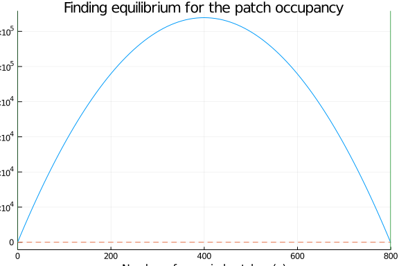
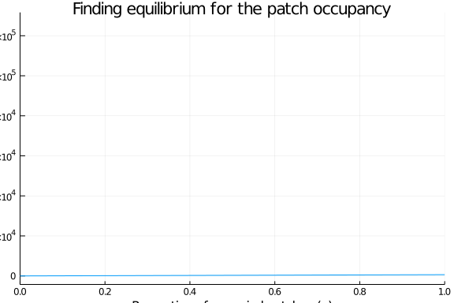
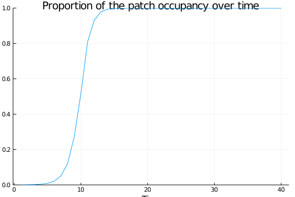

# Introduction

<!--The Levins model describes the occupancy of a series of patches, as a function of their colonization and extinction rate. Find the proportion of occupied patches at equilibrium, and then perform a simulation using an ordinary differential equation to confirm the results. Finally, assuming that the environment can be represented by a series of patches where patch i can colonize both (i-1) and (i+1), perform a simple simulation to see if you reach the same results, and discuss.-->

A metapopulation is an ecological concept where a population, composed by individuals from the same specie, are spatially and temporally devided in subpopulations. As a consequence of natural disasters and humain activities, the natural habitats of most species are fragmented into patches, resulting into the formation of metapopulation, where each patches within the distribution area of the specie can either be occupied or not by one of the subpopulations, in a dynamic way. This dynamic is defined by the total number of patches, the proportion of patches that are occupied, and by the local extinction and colonization of a patch. 

In this work, we will first use the Levins model, describing the occupancy of a series of patches, to identify the proportion of occupied patches at equilibrium, and perform a simulation based on an ordinary differential equation to confirm the result. We will then perform a second simulation, using a spatial series of patches, where every patch can colonize its direct neighbours, and compare the results.

# Required packages

````julia
using Plots
using DifferentialEquations
using StatsBase
using Statistics
using Measures
````


# Model description and justification

The Levins model is usually defined as 

$$\dot p = c(h-p)p-ep$$

where $p$ is the proportion of occupied patches, $h$ is the total number of patches, $c$ is the colonization rate (the rate at which each occupied patches are producing colonies), and $e$ is the extinction rate in occupied patches.

This model assumes that the habitat is homogenous and that each patches are providing the same quality of environment and are the same size. Also, the local dynamics within each patches is being ingnored, letting its state to either bein occupied or extinct.

# Model analysis

## Finding the equilibrium

We will first find the equilibrium for this continuous model. To achieve this, we have to find the value of the proportion of occupied patches ($\hat p$) for which there is no more variation in this proportion ($\dot p = 0$):

$$\dot p = c(h-p)p-ep = 0$$

By re-arrenging the terms, we obtain:

$$p[c(h-p)-e] = 0$$

The trivial equilibrium arises when $\hat p_1 = 0$, meaning that if there is no occupied patches within the habitat, there is no way to colonize new ones. 

The second equilibrium can be obtain with the following:

$$c(h-p)-e = 0$$

giving that the second equilibrium corresponds to $\hat p_2 = h - \frac{e}{c}$.

# Simulations

We will first visualize the equilibrium of this model with a graphical technic, starting by defining the Levins model:

````julia
"""
This function defines the Levins model, describing the occupancy of a series of patches, as a function of their colonization and extinction rate

It takes in argument: 
p: the initial proportion of occupied patches
param: a vector containing the parameters of the model
t: a vector defining the time steps

It returns:
dp/dt: the temporal changes in the value of the proportion of occupied patches

"""
function Levins(p, param, t)
    dp_dt = (param.c*(param.h-p)*p)-(param.e*p)
    return(dp_dt)
end
````


````
Main.##WeaveSandBox#402.Levins
````


We will set the initial parameters, the time lapse and vectors that will be needed for the simulation:

````julia
# Defining the total patches number, the extinction rate, and the colonization rate
param = (h=800.0, e=0.5, c=0.8) 

# Defining the time lapse t0 - t end
t=(0., 100.)

# Defining the proportion of initial occupied patches
#p=0.1

# Generating the varations of the proportion of the occupied patches
dp_dt_vec = zeros(Float64, 101)
#p_vec = 0.00:0.01:1.0
p_vec = 0:param.h/100/param.h:param.h/param.h
````


````
0.0:0.01:1.0
````


Now, we will simulate de model over time to visualise dp/dt in function of the number of occupied patches:

````julia
# Creating a vector for the number of occupied patches:
p_vec = 0:param.h/100:param.h

# Calculating dp/dt in regard of the proprtion of occupied patches
for i in 1:101
    dp_dt_vec[i] = Levins(p_vec[i], param, t)
    #println(p_vec[i])
    #println(dp_dt_vec[i])
end

# Plotting the (dp/dt) in function of p(t) graph 
plot(p_vec, dp_dt_vec, title="Finding equilibrium for the patch occupancy", xlabel="Number of occupied patches (p)", ylabel="(dp/dt)", legend =false, xlim=(0,param.h))

# Adding horizontal line where dp/dt = 0
hline!([0], ls=:dash)

# Adding vertical line for the values of p where the equilibrum should be reach
vline!([0, param.h-(param.e/param.c)])
````





The green vertical lines were placed where the equilibriums were expected to be reached. Knowing that this situation arises when dp/dt = 0 (dashed line), we can graphically see that the two values that were determined earlier ($\hat p_1 = 0, \hat p_2 = h - \frac{e}{c}$) are effectively equilibriums. Now, on visualizing dp/dt in function of the proportion of occupied patches:

````julia
# Calculating dp/dt in regard of the proprtion of occupied patches
for i in 1:101
    dp_dt_vec[i] = Levins(p_vec[i], param, t)
    #println(p_vec[i])
    #println(dp_dt_vec[i])
end

# Plotting the (dp/dt) in function of p(t) graph 
plot(p_vec, dp_dt_vec, title="Finding equilibrium for the patch occupancy", xlabel="Proportion of occupied patches (p)", ylabel="(dp/dt)", legend =false, xlim=(0,param.h/param.h))
````





We will now simulate this model as an ordinary differential equation problem:

````julia
# Defining the problem as an ODE
prob = ODEProblem(Levins, 0.3, t, param)
#x = Levins(0.1, param,t)
#typeof(prob)

# Definin the soluation of the problem
sol = solve(prob)/param.h

# Plotting the solution over time
plot(sol, title="Proportion of the patch occupancy over time", ylabel="Proportion of occupied patches (p)", xlabel="Time", legend =false, ylim=(0,1))
````





Here, starting with a non-zero proportion of occupied patches, we can see that over time this proportion is stabilizing at a value corresponding to the equilibrium that was earlier identify. 

We will now simulate this problem as a series of patches, where patch i can colonize both (i-1) and (i+1). We will start by defining a function that will help to calculate the probability of colonization of a patch of interest:

````julia
"""
This function will calculates the probability of colonisation of one patch, based on the number of occupied neighbors and their probability of colonization.
Knowing that the probability of not being colonized by one neigbour patches equals to 1-c, and that the probability of not being colonized by every occupied neighbors is (1-c)^occupied_neighbors, the probability of colonization is determined by 1-(1-c)ôccupied_neigbours. 
It takes in argument:
c: the probability of colonization of an occupied patch
occupied_neighbors: the number of direct neighbors around the patch (i-1 to i+1)
"""

function P_colonisation(c, occupied_neighbors)
    return 1.0-((1.0-c)^occupied_neighbors)
end
````


````
P_colonisation (generic function with 1 method)
````


We will now create a function that will create the initial landscape of study:

````julia
"""
This function creates the initial landscape of the study by sampling the patches of the environment and occording them a 'True' value, meaning that they are occupied, in regards of the initial occupancy.

It takes in arguments:
landscape: a table of boolean values corresponding to the size of the environement
initial_occupancy: the percentage of patches initially occupied
"""
function initial_landscape!(landscape, initial_occupancy)
    
    # total number of patches
    h = prod(size(landscape)) 
    
    # initial population size depending on the occupancy
    initial_populations = convert(Int64, ceil(h*initial_occupancy))
    println(initial_populations)
    
    
    # defining the numbers associated with the patches initially occupied (in count of initial_populations) from all patches (1:h)
    # sample is giving the numbers in columns
    initially_occupied = sample(1:h, initial_populations, replace=false)
    print(initially_occupied)
    #changing the sampled patches to true
    for patch in initially_occupied
        landscape[patch] = true
    end
end
````


````
Main.##WeaveSandBox#402.initial_landscape!
````


We will now need a function that will count the number of occupied patches surrounding the patch that we are looking at:

````julia
"""
This function calculates how many patches are occupied arround the one we are looking to (row_id, col_id). The patch itself counts as an occupied neighbors.

It takes in arguments:
landscape: the table containing the actually occupied patches
row_id: the number of the row of the patch that we are currently studying
col_id: the number of the column of the patch that we are currently studying

It returns:
A float value corresponding to the total number of occupied patches in the landscape
"""
# Calculates how many patches are occupied arround the one we are looking to (row_id, col_id). The patch itself counts as an occupied neighbors.
function count_neighbors(landscape, row_id, col_id)
    min_row = max((row_id-1), 1)
    min_col = max((col_id-1), 1)
    max_row = min((row_id+1), size(landscape, 1))
    max_col = min((col_id+1), size(landscape, 2))
    n_row = min_row:max_row
    n_col = min_col:max_col
    
    #Returns the number of occupied neighbors
    return float(sum(landscape[n_row, n_col]))
end
````


````
count_neighbors (generic function with 1 method)
````


The following function will allow to simulate the process of extinction and colonisation to the landscape, for one time step:

````julia
"""
This function will simulate the process of colonization and extinction over one time step, by modifing the old landscape into the new landscape, in regards of the extinction and colonization rates.

It takes in argument:
new_landscape: the actual landscape of study
landscape: the previous landscape of study
e: the extinction rate of an occupied patch
c: the colonization rate of an occupied patch
"""

function one_timestep!(new_landscape, landscape, e, c)
    
    # Analyzing every patches
    for row_id in 1:size(landscape, 1), col_id in 1:size(landscape, 2)
        # Calculating the number of occupied neighbors
        occupied_neighbors = count_neighbors(landscape, row_id, col_id)
        # Calculating the colonisation probability
        col_probability = P_colonisation(c, occupied_neighbors)
        # Applying the colonisation and extinction to the patches
        if landscape[row_id, col_id]
            new_landscape[row_id, col_id] = rand() < (1-e)+e*col_probability
        else
            new_landscape[row_id, col_id] = rand() < col_probability
        end
    end
end
````


````
one_timestep! (generic function with 1 method)
````


This last function will allow to do the simulation over a longer period of time:

````julia
"""
This function will perform the simulation of the process of extinction and colonisation over a long period of time

It takes in arguments:
X: the number of patches along the x dimension
Y: the number of patches along the y dimension
initial_occupancy: the pourcentage of initially occupied patches
e: the extinction rate of an occupied patches
c: the colonisation rate of an occupied patches

It returns:
occupancy: the occupancy of the landscape
landscape: the final updated landscape of the study
"""

function simulation(X, Y, initial_occupancy, e, c)

    # Creating the vectors needed for to create the landscapes
    landscape = zeros(Bool, (X,Y))
    new_landscape = similar(landscape)

    # Creating the starting population
    initial_landscape!(landscape, initial_occupancy)

    # Calculating the actual occupancy
    occupancy = zeros(Float64, 500)
    occupancy[1] = mean(landscape)

    # Running the simulation of time
    for timestep in 2:length(occupancy)
        # Updating the landscape
        one_timestep!(new_landscape, landscape, e, c)
        landscape = new_landscape
        # Updating the occupancy
        occupancy[timestep] = mean(landscape)
        #println(occupancy[timestep])
    end

    return (occupancy, landscape)
end
````


````
simulation (generic function with 1 method)
````


We are now ready to perform the simulation:

````julia
# performing the simulation
simulation(100, 8, 0.1, param.e, param.c)
````


````
80
[163, 104, 300, 233, 134, 678, 308, 540, 282, 26, 729, 780, 332, 450, 632, 
462, 552, 356, 322, 424, 44, 794, 530, 126, 101, 50, 76, 391, 724, 234, 464
, 732, 269, 637, 557, 193, 393, 760, 111, 771, 167, 615, 591, 654, 682, 521
, 83, 465, 273, 481, 357, 528, 48, 423, 442, 739, 321, 700, 415, 366, 460, 
292, 291, 766, 209, 490, 99, 455, 414, 348, 606, 367, 675, 535, 527, 447, 7
11, 688, 211, 778]([0.1, 0.49875, 0.9975, 1.0, 1.0, 1.0, 1.0, 1.0, 1.0, 1.0
  …  1.0, 1.0, 1.0, 1.0, 1.0, 1.0, 1.0, 1.0, 1.0, 1.0], Bool[1 1 … 1 1; 1 1
 … 1 1; … ; 1 1 … 1 1; 1 1 … 1 1])
````


# Conclusions

